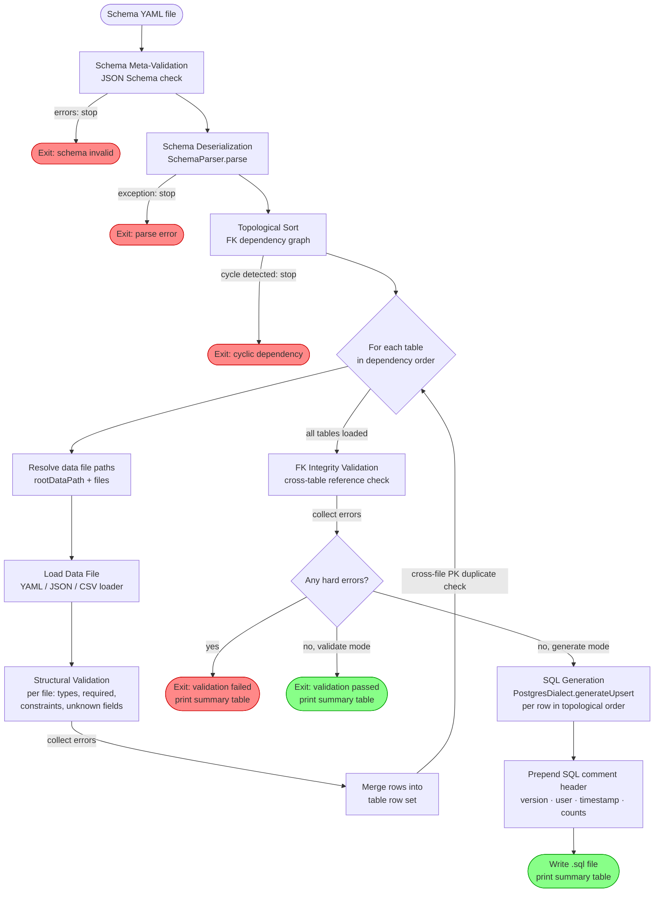

# Knoppen Tutorial

Knoppen reads a YAML schema describing your tables and a set of data files (YAML, JSON, or CSV), validates them, and generates PostgreSQL `INSERT ... ON CONFLICT` ("upsert") statements. It is designed for seeding test and reference data into a schema that already exists in a database.
  
---  

## Table of Contents

1. [Prerequisites](#1-prerequisites)
2. [Core Concepts](#2-core-concepts)
3. [Pipeline Flowchart](#3-pipeline-flowchart)
4. [Schema Reference](#4-schema-reference)
   - 4.1 [Root Fields](#41-root-fields)
   - 4.2 [Validation Configuration](#42-validation-configuration)
   - 4.3 [Table Definition](#43-table-definition)
   - 4.4 [Column Definition](#44-column-definition)
   - 4.5 [Column Types](#45-column-types)
   - 4.6 [Default Values](#46-default-values)
   - 4.7 [Constraints](#47-constraints)
   - 4.8 [Foreign Keys](#48-foreign-keys)
   - 4.9 [ON CONFLICT Configuration](#49-on-conflict-configuration)
5. [Generators Reference](#5-generators-reference)
6. [Data Files](#6-data-files)
   - 6.1 [YAML](#61-yaml)
   - 6.2 [JSON](#62-json)
   - 6.3 [CSV](#63-csv)
   - 6.4 [Splitting a Table Across Multiple Files](#64-splitting-a-table-across-multiple-files)
7. [Table Dependency Ordering](#7-table-dependency-ordering)
8. [CLI Reference](#8-cli-reference)
   - 8.1 [validate](#81-validate)
   - 8.2 [generate](#82-generate)
   - 8.3 [Shared Options](#83-shared-options)
9. [Generated SQL Output](#9-generated-sql-output)
10. [End-to-End Example](#10-end-to-end-example)
11. [Restrictions and Known Limitations](#11-restrictions-and-known-limitations)

---  

## 1. Prerequisites

| Requirement | Minimum Version |  
|-------------|----------------|  
| JDK | 17 (compiled with JDK 24) |  
| Gradle | 9.x (uses wrapper) |  

Build the runnable distribution:

```bash  
./gradlew build
```  

Run via Gradle (development):

```bash  
./gradlew run --args="generate myschema.yaml"
```  

Run from the fat JAR (after building):

`java -jar build/libs/Knoppen-0.5.0.jar generate myschema.yaml`

  
---  

## 2. Core Concepts

| Term | Description |  
|------|-------------|  
| **Schema file** | A YAML file that describes your database tables, columns, constraints, FK relationships, and where the data files live. |  
| **Data file** | A YAML, JSON, or CSV file containing one table's rows (one table per file). |  
| **Upsert** | A PostgreSQL `INSERT ... ON CONFLICT` statement that either inserts a new row or updates an existing one. |  
| **Generator** | A Kotlin-evaluated column value producer (e.g. auto-incrementing numbers, timestamps, FK-cycling IDs). |  
| **rootDataPath** | A directory path relative to the schema file used as a base for resolving all data file paths. |  
  
---  

## 3. Pipeline Flowchart


  
---  

## 4. Schema Reference

The schema is a single YAML file. The top-level structure is:

```yaml  
dialect: postgresql  
schema: my_schema  
rootDataPath: ../data       # optional  
validation:  
  defaultNullable: true  strictFields: falsetables:  
  - tableName: ...    ...  
```  

### 4.1 Root Fields

| Field | Type | Required | Description |  
|-------|------|----------|-------------|  
| `dialect` | string | Yes | SQL dialect. Currently only `postgresql` is supported. |  
| `schema` | string | Yes | Database schema namespace (e.g. `public`, `my_app`). Applied as a qualifier in generated SQL: `"my_app"."users"`. Must match `^[A-Za-z0-9_]+$`. |  
| `rootDataPath` | string | No | Base directory for data file resolution, relative to the schema file's own directory. All `files:` entries in table definitions are resolved against this path. Defaults to the schema file's directory if omitted. |  
| `validation` | object | Yes | Global validation settings (see §4.2). |  
| `tables` | array | Yes | List of table definitions (at least one required). |  

### 4.2 Validation Configuration

```yaml  
validation:  
  defaultNullable: true  
  strictFields: false  
```  

| Field | Type | Default | Description |  
|-------|------|---------|-------------|  
| `defaultNullable` | boolean | — (required) | When `true`, all columns are nullable unless a `required` constraint is present. When `false`, every column is required unless a default is defined. |  
| `strictFields` | boolean | `false` | When `true`, any field in a data file that is not declared in the schema is an **ERROR** (blocks generation). When `false`, it is a **WARNING** (advisory only). The CLI `--strict` / `--no-strict` flag overrides this at runtime; the CLI defaults to `true`. |  

### 4.3 Table Definition
```yaml
tables:
  - tableName: orders
    description: "Customer purchase orders"
    files:
      - orders.yaml
      - orders_extra.csv
    primaryKey: [id]
    onConflict:
      target: [id]
      action: update
      excludeFromUpdate: [id, created_at]
    columns:
      - ...
```


| Field         | Type             | Required | Description                                                                                                                     |     |
| ------------- | ---------------- | -------- | ------------------------------------------------------------------------------------------------------------------------------- | --- |
| `tableName`   | string           | Yes      | Exact table name as it exists in the database. Must match `^[A-Za-z0-9_]+$`.                                                    |     |
| `description` | string           | No       | Human-readable description. Not used in SQL output.                                                                             |     |
| `files`       | array of strings | No       | Data file paths for this table. Each path is resolved against `rootDataPath`. A table with no `files` entries generates no SQL. |     |
| `primaryKey`  | array of strings | Yes      | One or more column names forming the primary key. Used for duplicate PK detection across files.                                 |     |
| `onConflict`  | object           | No       | Conflict-resolution strategy (see §4.9). If omitted, a plain `INSERT` is generated with no conflict clause.                     |     |
| `columns`     | array            | Yes      | Column definitions (at least one required).                                                                                     |     |

### 4.4 Column Definition

```yaml  
columns:  
  - name: user_id    type: INTEGER    foreignKey:      table: users      columns: [id]    default:      type: LITERAL      value: "0"    constraints:      - type: required  
```  

| Field | Type | Required | Description |  
|-------|------|----------|-------------|  
| `name` | string | Yes | Column name. Must match `^[A-Za-z0-9_]+$`. |  
| `type` | string | Yes | SQL type string (see §4.5). |  
| `default` | object | No | Default value applied when the data file omits the column (see §4.6). |  
| `foreignKey` | object | No | FK reference to a parent table (see §4.8). |  
| `constraints` | array | No | Validation constraints applied to the column's data values (see §4.7). |  

### 4.5 Column Types

The `type` field is a raw SQL type string. It must be **uppercase** with optional numeric parameters:

| Example | Notes |  
|---------|-------|  
| `INTEGER` | 32-bit integer |  
| `BIGINT` | 64-bit integer |  
| `NUMERIC(8,2)` | Decimal with precision 8, scale 2 |  
| `DECIMAL` | Synonym for NUMERIC |  
| `VARCHAR(255)` | Variable-length string |  
| `TEXT` | Unbounded string |  
| `BOOLEAN` | Boolean (`true`/`false`) |  
| `TIMESTAMP` | Timestamp (parsed as ISO-8601) |  
| `DATE` | Date (parsed as ISO-8601) |  
| `JSONB` | PostgreSQL JSON binary — values are cast with `::jsonb` in output |  
| `JSON` | PostgreSQL JSON text |  

> **Type pattern**: `^[A-Z]+(?:\([0-9]+(,[0-9]+)?\))?$`  > Example valid: `VARCHAR(30)`, `NUMERIC(8,2)`, `INTEGER`.    
> The base type (before `(`) is used for validation; unknown base types are allowed without error.

### 4.6 Default Values

A `default` block describes how to fill a column when the data file row does not include it.

```yaml  
default:  
  type: LITERAL | FUNCTION | EXPRESSION | GENERATOR  value: "..."  args: []        # only used by FUNCTION type  
```  

| `type` | Rendered in SQL | Example `value` | Output |  
|--------|----------------|----------------|--------|  
| `LITERAL` | Quoted string literal | `"Knoppen"` | `'Knoppen'` |  
| `FUNCTION` | Unquoted SQL function call | `CURRENT_TIMESTAMP` | `CURRENT_TIMESTAMP` |  
| `EXPRESSION` | Raw SQL expression, rendered as-is | `'[]'::jsonb` | `'[]'::jsonb` |  
| `GENERATOR` | Evaluated in Kotlin per row before SQL is built | `SEQUENCE(10,10)` | e.g. `10`, `20`, `30` |  

**LITERAL** is useful for fixed string or numeric defaults:
```yaml  
default:  
  type: LITERAL  value: "active"    # → 'active' in SQL  
```  

**FUNCTION** is for SQL functions you want the database to evaluate at insert time:
```yaml  
default:  
  type: FUNCTION  value: CURRENT_TIMESTAMP    # → CURRENT_TIMESTAMP in SQL (no quotes)  
```  

**EXPRESSION** is for complex SQL that is neither a simple string nor a bare function:
```yaml  
default:  
  type: EXPRESSION  value: "'[]'::jsonb"    # → '[]'::jsonb in SQL  
```  

**GENERATOR** (see §5 for the full reference) is evaluated by Knoppen for each row before writing SQL. The generated value is inserted as a quoted or unquoted literal depending on its type:
```yaml  
default:  
  type: GENERATOR  value: "SEQUENCE(1, 1)"    # row 0 → 1, row 1 → 2, ...  
```  

> **Data file override**: If a data file row includes a value for a column that has a `GENERATOR` default, the data file value takes precedence. The generator is only invoked when the column is absent from the row.

### 4.7 Constraints

Constraints validate each row's column values. Failures produce either an `ERROR` (blocks SQL generation) or a `WARNING` (advisory).

#### `required`

The field must be present and non-null.

```yaml  
constraints:  
  - type: required    message: "user_id is required"    # optional custom message  
```  

#### `unique`

All values for this column within the loaded data file must be distinct.

```yaml  
constraints:  
  - type: unique    conflictTarget: false    # set to true if this column is the ON CONFLICT target    message: "email must be unique"  
```  

Setting `conflictTarget: true` means this unique constraint is the one driving the `ON CONFLICT (column)` clause. Duplicate values in the data file for a column with `conflictTarget: true` are silently allowed — they represent intentional conflict-row testing and will not trigger a uniqueness error.

#### `enum`

The value must be one of a declared set of strings.

```yaml  
constraints:  
  - type: enum    values: ["ACTIVE", "PENDING", "CLOSED"]    message: "status must be ACTIVE, PENDING, or CLOSED"  
```  

#### `pattern`

The string value must match a regular expression.

```yaml  
constraints:  
  - type: pattern    regex: "^[a-zA-Z0-9_]{3,50}$"    message: "username must be 3-50 alphanumeric characters or underscores"  
```  

The regex is matched with `containsMatchIn` (substring match). Use `^` and `$` anchors for a full-string match.

#### `temporal`

Validates that a `TIMESTAMP` or `DATE` value falls within acceptable time bounds.

```yaml  
constraints:  
  - type: temporal    notFuture: true        # rejects timestamps after validation time    notPast: "-P4Y"        # rejects timestamps older than 4 years (ISO 8601 negative period)  
```  

| Option | Type | Description |  
|--------|------|-------------|  
| `notFuture` | boolean | If `true`, values after the current timestamp are an **ERROR**. |  
| `notPast` | string | ISO 8601 negative duration (e.g. `-P4Y`, `-P6M`, `-P1Y6M`). Values older than this boundary are a **WARNING** (advisory, does not block generation). |  

> **Temporal severity**: `notFuture` violations are **errors**. `notPast` violations are **warnings** — they flag stale data without blocking generation.

### 4.8 Foreign Keys

A `foreignKey` block on a column declares a reference to a column in another table.

```yaml  
- name: user_id  
  type: INTEGER  foreignKey:    schema: my_app      # optional — inherits root schema if omitted    table: users    columns: [id]       # referenced column(s) in parent table    onUpdate: cascade   # optional    onDelete: noAction  # optional  
```  

| Field | Type | Required | Description |  
|-------|------|----------|-------------|  
| `schema` | string | No | Schema qualifier. Inherits the root `schema` if omitted. |  
| `table` | string | Yes | Parent table name. |  
| `columns` | array | Yes | Referenced column name(s) in the parent table. |  
| `onUpdate` | string | No | One of: `cascade`, `setNull`, `setDefault`, `restrict`, `noAction` (default). |  
| `onDelete` | string | No | Same values as `onUpdate`. |  

> **Runtime FK validation**: When Knoppen loads data, it checks that every non-null FK value appears in the corresponding parent table's loaded data rows. A missing parent row is an **ERROR**. A missing parent table (no `files:` declared for it) is a **WARNING**.
>
> **Limitation**: Only the **first** entry in `columns` is used for runtime FK integrity checking. Multi-column composite FK references are declared but only the first column is validated against parent row data.

**Referential actions** are recorded in the schema model but are **not emitted into the generated SQL** (Knoppen generates `INSERT ... ON CONFLICT`, not `CREATE TABLE` DDL). They exist to document intent for when you write your DDL separately.

### 4.9 ON CONFLICT Configuration

The `onConflict` block controls how PostgreSQL handles a row that conflicts with an existing one.

```yaml  
onConflict:  
  target: [id]              # column(s) in ON CONFLICT (...) clause  action: update            # or doNothing  excludeFromUpdate:        # columns never overwritten on conflict    - id    - created_at  
```  

| Field | Type | Required | Description |  
|-------|------|----------|-------------|  
| `target` | array | Yes | Column(s) used in `ON CONFLICT (col, ...)`. Usually the PK, but can be a unique constraint. |  
| `action` | string | Yes | `update` → `DO UPDATE SET ...` for every non-excluded column. `doNothing` → `DO NOTHING`. |  
| `excludeFromUpdate` | array | No | Columns omitted from the `DO UPDATE SET` clause. Use this to protect immutable fields like creation timestamps or surrogate PKs. |  

**Example: protect created_at and id on conflict:**
```yaml  
onConflict:  
  target: [id]  action: update  excludeFromUpdate: [id, created_at]  
```  
Generates:
```sql  
INSERT INTO "my_schema"."orders" ("id", "amount", "created_at", "status")  
VALUES (42, 99.99, CURRENT_TIMESTAMP, 'active')  
ON CONFLICT ("id") DO UPDATE SET  
  "amount" = EXCLUDED."amount",  "status" = EXCLUDED."status"  
```  
Note `id` and `created_at` are absent from the `DO UPDATE SET` clause.

**Conflict target vs primary key**: The `target` does not have to match `primaryKey`. You can point it at a unique constraint column instead:
```yaml  
primaryKey: [id]  
onConflict:  
  target: [email]     # unique constraint on email, not the PK  action: update  excludeFromUpdate: [id, email]  
```  
  
---  

## 5. Generators Reference

Generators are column value producers evaluated by Knoppen in Kotlin before SQL is written. They are declared as a column `default` with `type: GENERATOR`.

A generator is only invoked when the data file row **omits** that column. If the row supplies a value, the generator is bypassed.

Generators are **reset** between tables (the sequence counter restarts for each new table).

### SEQUENCE

Produces an incrementing numeric series.

```yaml  
default:  
  type: GENERATOR  value: "SEQUENCE(start, step)"  # or  value: "SEQUENCE(start, step, suffix)"  
```  

| Argument | Type | Description |  
|----------|------|-------------|  
| `start` | integer | First value |  
| `step` | integer | Increment per row (must not be zero; negative values count down) |  
| `suffix` | string | Optional string appended to each value |  

Examples:

| Expression | Row 0 | Row 1 | Row 2 | Row 3 |  
|-----------|-------|-------|-------|-------|  
| `SEQUENCE(10,10)` | 10 | 20 | 30 | 40 |  
| `SEQUENCE(100,100,_id)` | `100_id` | `200_id` | `300_id` | `400_id` |  
| `SEQUENCE(5,-1)` | 5 | 4 | 3 | 2 |  

### COUNTER

Shorthand for `SEQUENCE(start, 1)` — increments by 1 each row.

```yaml  
default:  
  type: GENERATOR  value: "COUNTER(1)"    # → 1, 2, 3, 4, ...  
```  

### TEMPLATE

Produces a string by filling named placeholders in a pattern.

```yaml  
default:  
  type: GENERATOR  value: "TEMPLATE(USR-{yyyyMMdd}-{rownum:03d})"  
```  

Available placeholders:

| Placeholder | Description | Example |  
|-------------|-------------|---------|  
| `{index}` | 0-based row index | `0`, `1`, `2` |  
| `{index:03d}` | Zero-padded 0-based index | `000`, `001`, `002` |  
| `{rownum}` | 1-based row number | `1`, `2`, `3` |  
| `{rownum:03d}` | Zero-padded 1-based number | `001`, `002`, `003` |  
| `{uuid}` | Random UUID v4 | `550e8400-...` |  
| `{date}` | Today's date (UTC, ISO-8601) | `2026-06-25` |  
| `{datetime}` | Current UTC datetime (ISO-8601) | `2026-06-25T20:00:00Z` |  
| `{yyyyMMdd}` | Today compact | `20260625` |  
| `{HHmmss}` | Current time compact | `200000` |  

The format spec `{index:03d}` follows `String.format("%03d", value)` — zero-pad and width specifiers are supported.

### TIMESTAMP_OFFSET

Produces timestamps offset from "now" by an incrementing multiple of a time unit.

```yaml  
default:  
  type: GENERATOR  value: "TIMESTAMP_OFFSET(unit, step)"  
```  

| Argument | Values | Description |  
|----------|--------|-------------|  
| `unit` | `DAYS`, `HOURS`, `MINUTES`, `SECONDS` | Time unit |  
| `step` | integer | Offset multiplied by row index. Negative values go into the past. |  

The offset for row N is: `now + (N × step × unit)`.

| Expression | Row 0 | Row 1 | Row 2 |  
|-----------|-------|-------|-------|  
| `TIMESTAMP_OFFSET(HOURS,-6)` | now | now−6h | now−12h |  
| `TIMESTAMP_OFFSET(DAYS,1)` | now | now+1d | now+2d |  
| `TIMESTAMP_OFFSET(MINUTES,30)` | now | now+30m | now+1h |  

### UUID

Generates a random UUID v4 for each row.

```yaml  
default:  
  type: GENERATOR  value: "UUID()"  
```  

Output: `'550e8400-e29b-41d4-a716-446655440000'`

### CYCLE

Cycles through a fixed list of values indefinitely.

```yaml  
default:  
  type: GENERATOR  value: "CYCLE(PENDING, ACTIVE, CLOSED)"  
```  

| Row | Value |  
|-----|-------|  
| 0 | `PENDING` |  
| 1 | `ACTIVE` |  
| 2 | `CLOSED` |  
| 3 | `PENDING` (wraps) |  
| 4 | `ACTIVE` |  

Requires at least 2 values. Useful for distributing status/category values evenly across test rows.

### DISTRIBUTE

Distributes values proportionally across rows based on percentage weights. **Weights must sum to exactly 100.**

```yaml  
default:  
  type: GENERATOR  value: "DISTRIBUTE(70:ACTIVE, 20:PENDING, 10:CLOSED)"  
```  

For 10 rows: 7 × `ACTIVE`, 2 × `PENDING`, 1 × `CLOSED`. Values are interleaved (not grouped) using the largest-remainder method. Requires at least 2 weight:value pairs.

### FOREIGN_CYCLE

Cycles through values that were generated (or loaded) for another table's column earlier in the same run. This is the primary way to populate FK columns without hardcoding IDs in data files.

```yaml  
default:  
  type: GENERATOR  value: "FOREIGN_CYCLE(users, id)"  
```  

This reads all `id` values that were produced for the `users` table and cycles through them. The parent table must appear **before** the current table in declaration order (Knoppen processes tables in topological dependency order, so if FK relationships are declared correctly this is automatic).

| users.id generated | audit_log.user_id (FOREIGN_CYCLE) |  
|-------------------|------------------------------------|  
| 1, 2, 3, 4, 5 | 1, 2, 3, 4, 5, 1, 2, 3, ... |  

> **Note**: `FOREIGN_CYCLE` reads the values Knoppen generated or computed during the current run, not values from the database. If a column uses a hardcoded value in the data file (not a generator), those values are also recorded and available to `FOREIGN_CYCLE`.
  
---  

## 6. Data Files

Each data file contains the rows for exactly **one** table. The format is determined by the file extension.

### 6.1 YAML

Extension: `.yaml` or `.yml`

The file must be a **plain YAML list** at the top level. Each list item is a mapping (object) representing one row. Only include columns you want to set — columns with generators or defaults can be omitted.

```yaml  
# orders.yaml  
- id: 1  
  customer_id: 42  amount: 99.99  status: "ACTIVE"  
- id: 2  
  customer_id: 43  amount: 149.00  # status omitted — will use schema default if defined  
```  

> **Legacy format**: An older format wrapping the list under a table-name key (`tableName: [...]`) is supported for backwards compatibility but is **not recommended**. New files should use the plain list format shown above.

**Null values** can be expressed with YAML's native `null` or by omitting the key entirely.

**JSONB columns** can use inline YAML objects or JSON-style strings:
```yaml  
- id: 1  
  metadata:    role: admin    tags: [one, two]  
```  

### 6.2 JSON

Extension: `.json`

The file must be a **JSON array** at the top level. Each element is a JSON object.

```json  
[  
  { "id": 1, "customer_id": 42, "amount": 99.99, "status": "ACTIVE" },  { "id": 2, "customer_id": 43, "amount": 149.00 }]  
```  

JSON data files do not carry line number information, so validation errors will not include a source line number.

### 6.3 CSV

Extension: `.csv`

The first row is the **header row** (column names). Each subsequent row is a data row.

```csv  
id,customer_id,amount,status  
1,42,99.99,ACTIVE  
2,43,149.00,  
```  

Type coercion is applied automatically:

| CSV value | Converted to |  
|-----------|-------------|  
| empty string | `null` |  
| `true` / `false` | Boolean |  
| integer string (e.g. `42`) | Integer |  
| long integer string | Long |  
| decimal string (e.g. `99.99`) | Double |  
| anything else | String |  

CSV data files do not carry line number information.

### 6.4 Splitting a Table Across Multiple Files

A table can load from more than one file. List all files under `files:`:

```yaml  
- tableName: users  
  files:    - users_base.yaml    - users_extra.csv    - users_admin.json  primaryKey: [id]  ...  
```  

Files are loaded and merged in the order listed. Rows from later files are appended after rows from earlier files.

**Cross-file PK duplicate detection**: If the same primary key value appears in two different files, it is flagged as an **ERROR**. Duplicate PKs within a single file are allowed — they represent intentional ON CONFLICT rows for testing upsert behavior.
  
---  

## 7. Table Dependency Ordering

Knoppen automatically sorts tables in topological dependency order so that parent tables are always processed before child tables. This ensures:

- FK validation finds parent rows before checking children.
- `FOREIGN_CYCLE` generators have parent values available when child rows are generated.
- SQL statements are emitted in an order that respects referential integrity.

The dependency graph is built from `foreignKey.table` declarations. If table A has a FK to table B, then B is processed before A.

**Declaration order is preserved for tables at the same dependency level** (tables with no FK relationship between them appear in the order they were declared in the schema).

**Cycle detection**: If a cycle exists in the FK graph (A → B → C → A), Knoppen immediately reports an error and stops:

```  
ERROR: Cyclic dependency detected in table definitions  
```  

In this case, restructure your schema to break the cycle (e.g. make one direction of the relationship optional with a nullable FK).
  
---  

## 8. CLI Reference

The CLI has two subcommands: `validate` and `generate`.

```  
knoppen <command> SCHEMA [options]  
```  

### 8.1 validate

Runs schema meta-validation, schema deserialization, data file loading, structural validation, and FK integrity checks — but does **not** generate SQL.

```bash  
knoppen validate myschema.yamlknoppen validate myschema.yaml --no-strictknoppen validate myschema.yaml --root-data-path /usr/local/test/data
```  

Exit code `0` = all checks passed (warnings are allowed).    
Exit code `1` = one or more errors found.

### 8.2 generate

Runs everything `validate` does, then generates SQL and writes it to the output file.

```bash  
knoppen generate myschema.yamlknoppen generate myschema.yaml --output /tmp/seed.sqlknoppen generate myschema.yaml --output seed.sql --no-strict --root-data-path /data
```  

Exit code `0` = SQL written successfully (warnings are allowed).    
Exit code `1` = errors found; no SQL file written.

### 8.3 Shared Options

| Option                     | Default                                            | Description                                                                                                                                                                                 |     |
| -------------------------- | -------------------------------------------------- | ------------------------------------------------------------------------------------------------------------------------------------------------------------------------------------------- | --- |
| `SCHEMA`                   | — (required)                                       | Path to the schema YAML file. A bare filename (no directory separator) is resolved from the current working directory. A path with `/` or `\` is used as-is.                                |     |
| `--output`, `-o`           | `<schema-name>.sql` in the schema file's directory | Where to write the generated SQL file. A relative path is resolved from CWD.                                                                                                                |     |
| `--strict` / `--no-strict` | `--strict`                                         | Overrides the schema's `validation.strictFields`. With `--strict`, any undeclared field in a data row is an **error** that blocks generation. With `--no-strict`, it is a **warning** only. |     |
| `--root-data-path`         | Schema's `rootDataPath`                            | Overrides the `rootDataPath` in the schema. An absolute path is used directly; a relative path is resolved from CWD.                                                                        |     |

### Summary Table

After every run (validate or generate), Knoppen prints a Mordant summary table:

```  
                    Knoppen generate┌─────────────────────┬──────────────┬──────┬────────┐  
│ File                │ Table        │ Rows │ Status │  
├─────────────────────┼──────────────┼──────┼────────┤  
│ code_sample.yaml    │ (schema)     │ —    │ ✓      │  
│ tag.yaml            │ tag          │ 6    │ ✓      │  
│ users.yaml          │ users        │ 4    │ ✓      │  
│ users2.yaml         │ users        │ 3    │ ✓      │  
│ post.yaml           │ post         │ 6    │ ✓      │  
│ post_tag.yaml       │ post_tag     │ 8    │ ✓      │  
│ audit_log.yaml      │ audit_log    │ 9    │ ✓      │  
│ post_approval.yaml  │ post_approval│ 6    │ ✓      │  
├─────────────────────┴──────────────┴──────┴────────┤  
│ 0 error(s)   1 warning(s)   Time: 245ms            │  
└────────────────────────────────────────────────────┘  
  
WARN   [table='users', row=3, field='approvedTs', line=43] ...  
```  

Status is `✓` if no errors for that table's rows, `✗` if any error was found. Full error details are printed below the table.
  
---  

## 9. Generated SQL Output

Each generated SQL file begins with a comment header:

```sql  
-- ============================================================  
-- Generated by Knoppen version 0.5.0  
-- User:      dutch  
-- Generated: 2026-06-25 20:46:10  
-- ------------------------------------------------------------  
-- Tables:  
--   tag:                 6 statement(s)  
--   users:               7 statement(s)  
--   post:                6 statement(s)  
--   post_tag:            8 statement(s)  
--   audit_log:           9 statement(s)  
--   post_approval:       6 statement(s)  
-- ============================================================  
```  

Each statement is preceded by a comment identifying its source:

```sql  
-- Table: tag, row[0]  
INSERT INTO "code_sample"."tag" ("id", "name", "column_order")  
VALUES (1, 'technology', 10)  
ON CONFLICT ("id") DO NOTHING;  
  
-- Table: tag, row[1]  
INSERT INTO "code_sample"."tag" ("id", "name", "column_order")  
VALUES (2, 'science', 20)  
ON CONFLICT ("id") DO NOTHING;  
```  

For `action: update`:

```sql  
-- Table: users, row[0]  
INSERT INTO "code_sample"."users" ("id", "source", "type", "createTs", "approvedTs", "username", "metadata")  
VALUES (1, 'Knoppen', 'ADMIN', CURRENT_TIMESTAMP, '2023-06-01 09:00:00+00'::timestamp, 'alice', '[]'::jsonb)  
ON CONFLICT ("id") DO UPDATE SET  
  "source" = EXCLUDED."source",  "type" = EXCLUDED."type",  "approvedTs" = EXCLUDED."approvedTs",  "username" = EXCLUDED."username",  "metadata" = EXCLUDED."metadata";  
```  

Note:
- Column and table names are always double-quoted.
- The schema qualifier is always included: `"schema_name"."table_name"`.
- `JSONB` values are cast with `::jsonb`.
- `TIMESTAMP` values are cast with `::timestamp`.
- SQL functions (`CURRENT_TIMESTAMP`) are emitted unquoted.
- SQL expressions (`'[]'::jsonb`) are emitted as-is.

---  

## 10. End-to-End Example

This section builds a small two-table schema from scratch.

### Step 1: Directory layout

```  
project/  
├── schemas/  
│   └── blog.yaml          ← schema file  
└── data/  
    ├── category.yaml    └── article.yaml
```  

### Step 2: Schema file (`schemas/blog.yaml`)

```yaml  
dialect: postgresql
schema: blog
rootDataPath: ../data

validation:
  defaultNullable: true
  strictFields: true

tables:

  # ── Lookup table ─────────────────────────────────
  - tableName: category
    description: "Article categories"
    files:
      - category.yaml
    primaryKey: [id]

    onConflict:
      target: [id]
      action: doNothing

    columns:
      - name: id
        type: INTEGER
        constraints:
          - type: required

      - name: name
        type: VARCHAR(100)
        constraints:
          - type: required
          - type: unique
            conflictTarget: false
          - type: pattern
            regex: "^[A-Za-z ]+$"
            message: "category name must contain only letters and spaces"

      - name: display_order
        type: INTEGER
        default:
          type: GENERATOR
          value: "SEQUENCE(10, 10)"

  # ── Main content table ────────────────────────────
  - tableName: article
    description: "Blog articles"
    files:
      - article.yaml
    primaryKey: [id]

    onConflict:
      target: [id]
      action: update
      excludeFromUpdate:
        - id
        - category_id
        - created_at

    columns:
      - name: id
        type: INTEGER
        constraints:
          - type: required

      - name: category_id
        type: INTEGER
        foreignKey:
          table: category
          columns: [id]
          onUpdate: cascade
        constraints:
          - type: required

      - name: title
        type: VARCHAR(200)
        constraints:
          - type: required
          - type: pattern
            regex: "^.{1,200}$"
            message: "title must be between 1 and 200 characters"

      - name: status
        type: VARCHAR(20)
        constraints:
          - type: enum
            values: ["DRAFT", "PUBLISHED", "ARCHIVED"]
            message: "status must be DRAFT, PUBLISHED, or ARCHIVED"
        default:
          type: LITERAL
          value: "DRAFT"

      - name: created_at
        type: TIMESTAMP
        default:
          type: FUNCTION
          value: CURRENT_TIMESTAMP

      - name: slug
        type: VARCHAR(200)
        default:
          type: GENERATOR
          value: "TEMPLATE(article-{rownum:03d}-{yyyyMMdd})"
```  


### Step 3: Data file for categories (`data/category.yaml`)

```yaml  
- id: 1  
  name: "Technology"  # display_order generated: 10  
- id: 2  
  name: "Science"  # display_order generated: 20  
- id: 3  
  name: "Health"  # display_order generated: 30  
```  

### Step 4: Data file for articles (`data/article.yaml`)

```yaml  
- id: 1001  
  category_id: 1  title: "Introduction to Databases"  status: "PUBLISHED"  # created_at → CURRENT_TIMESTAMP  # slug generated: article-001-20260625  
- id: 1002  
  category_id: 2  title: "The Science of Sleep"  # status omitted → LITERAL default → 'DRAFT'  # slug generated: article-002-20260625  
- id: 1003  
  category_id: 1  title: "Advanced SQL Queries"  status: "PUBLISHED"  
# ── Conflict row: update title of article 1002 ────  
- id: 1002  
  category_id: 2                    # preserved (excludeFromUpdate)  title: "The Science of Sleep - Revised"  status: "PUBLISHED"  
```  

### Step 5: Validate

```bash  
knoppen validate schemas/blog.yaml
```  

Expected output: summary table with 3 category rows + 4 article rows, 0 errors.

### Step 6: Generate

```bash  
knoppen generate schemas/blog.yaml --output /tmp/blog_seed.sql
```  

The file `/tmp/blog_seed.sql` is created. Statements for `category` appear before `article` (topological order respects the FK).

### Step 7: Run against your database

```bash  
psql -h localhost -U myuser -d mydb -f /tmp/blog_seed.sql
```  
  
---  

## 11. Restrictions and Known Limitations

### Dialect

- **PostgreSQL only.** No MySQL, SQLite, SQL Server, or other dialects. The `dialect` field accepts only `postgresql`. Adding a new dialect requires implementing the `SqlDialect` interface in Kotlin.

### SQL Output

- **Upsert-only.** Knoppen generates `INSERT ... ON CONFLICT` statements. It does not generate `UPDATE`-only statements, `DELETE` statements, or DDL (`CREATE TABLE`, `ALTER TABLE`, etc.).
- **No transaction wrapping.** The output file is a plain list of statements with no `BEGIN`/`COMMIT`.
- **No `RETURNING` clause.** Generated IDs or timestamps are not captured.
- **No sequences or identity columns.** Knoppen does not issue `NEXTVAL(...)` or use `DEFAULT` for auto-increment columns. Primary key values must be explicit in the data file or produced by a `GENERATOR`.

### Data Files

- **One table per file.** Each data file maps to exactly one table. A file cannot contain rows for multiple tables.
- **Plain list format required.** YAML files must use a bare list at the top level. The legacy `tableName: [...]` wrapper is tolerated for compatibility but will not be supported indefinitely.
- **CSV type coercion is simple.** Empty strings become `null`; `true`/`false` become booleans; integer-shaped strings become integers; decimal-shaped strings become doubles. There is no way to force a specific type in CSV — use YAML or JSON if you need finer control.
- **No CSV quoting for commas in values.** The CSV parser follows standard quoting rules (`"value with, comma"`), but complex multi-line CSV values may not parse correctly.

### Foreign Key Validation

- **Data-set-only validation.** FK checks run against the rows loaded in the current run. Rows already in the database are not consulted. A FK value that exists in the DB but not in the current data set will fail validation.
- **Single-column FK validation only.** When a `foreignKey` block lists multiple columns (e.g. a composite FK), only the **first** column in the `columns` list is checked against parent data rows at runtime. The remaining columns are declared but not validated.
- **Parent table with no declared files is a WARNING, not an error.** If a FK references a table that has no `files:` entries, the FK check is skipped with a warning, allowing partial schemas where some tables are populated externally.

### Generators

- **`DISTRIBUTE` weights must sum to exactly 100.** There is no support for fractional weights or weights that sum to a different total.
- **`FOREIGN_CYCLE` requires same-run data.** It reads values generated in the current Knoppen run. If you reference a parent table that has no data in the current run (no files), `FOREIGN_CYCLE` will throw an error at generation time.
- **Generator columns with data-file values skip the generator.** If a row in the data file supplies a value for a `GENERATOR` column, that value is used and the generator is not invoked for that row. This is intentional (for conflict rows that need specific values) but can cause gaps in a `SEQUENCE`.
- **`SEQUENCE` resets per table, not per file.** If a table has multiple files, the sequence counter continues across files (it does not reset between them).

### Schema

- **Column names** must match `^[A-Za-z0-9_]+$`. Quoted identifiers with special characters are not supported.
- **Type strings** must be uppercase: `INTEGER`, `VARCHAR(30)`, `NUMERIC(8,2)`. Lowercase types like `int` or `varchar(30)` will fail JSON schema validation.
- **No schema inheritance or includes.** Each schema file is fully self-contained. There is no way to share a common base schema between multiple schema files.
- **Cyclic FK dependencies** cause an immediate error with no partial output.
- **`onConflict` is all-or-nothing.** You cannot define per-column conflict-resolution logic beyond `excludeFromUpdate`. There is no support for `DO UPDATE SET col = col + EXCLUDED.col` style expressions.

### Validation

- **Unknown fields** are determined at load time. If a data file row contains a field not declared in the schema, it is a WARNING (or ERROR if `strictFields` is on). It is not silently dropped — the unknown field is still included in the generated SQL if generation proceeds.
- **`notPast` temporal violations are always warnings.** You cannot escalate them to errors. If you need strict date freshness enforcement, use a `pattern` or `enum` constraint as a workaround.
- **No cross-row constraint validation** beyond uniqueness. There is no support for "sum of column X across all rows must equal Y" or similar aggregate constraints.

### CLI

- **Schema file path**: a bare filename (no directory separator) is resolved from CWD. A path containing `/` or `\` is used as-is. There is no support for classpath or URL-based schema references.
- **`--root-data-path` relative paths** are resolved from CWD, not from the schema file's directory.