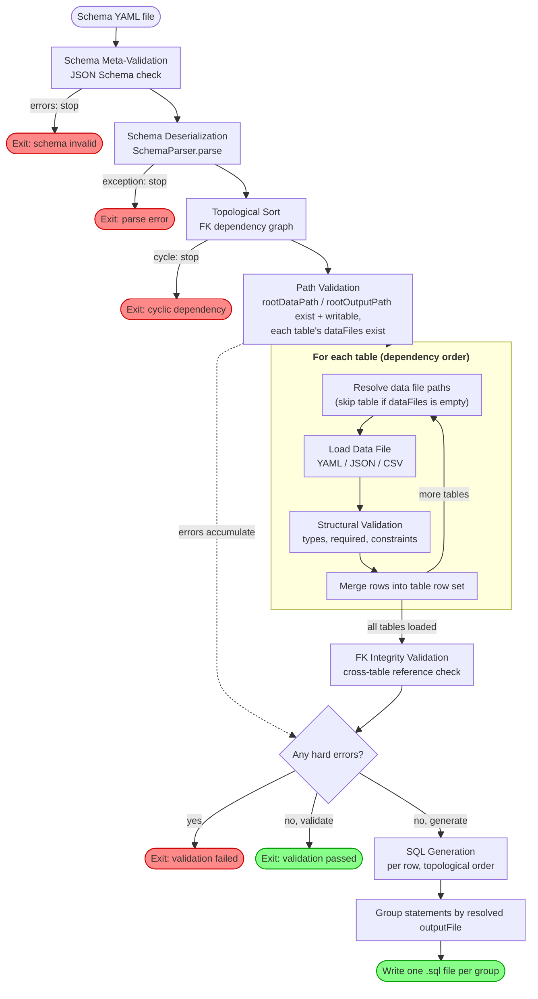

# Knoppen Tutorial

Knoppen reads a YAML schema describing your tables and a set of data files (YAML, JSON, or CSV), validates them, and generates PostgreSQL `INSERT ... ON CONFLICT` ("upsert") statements. It is designed for seeding test and reference data into a schema that already exists in a database.
  
---  

## Table of Contents

1. [Prerequisites](#1-prerequisites)
2. [Core Concepts](#2-core-concepts)
3. [Pipeline Flowchart](#3-pipeline-flowchart)
4. [Schema Reference](#4-schema-reference)
   - 4.1 [Root Fields](#41-root-fields)
   - 4.2 [Validation Configuration](#42-validation-configuration)
   - 4.3 [Table Definition](#43-table-definition)
     - 4.3.1 [Multi-Row Batching](#431-multi-row-batching)
   - 4.4 [Column Definition](#44-column-definition)
     - 4.4.1 [Column-Level Conflict Merge Strategy](#441-column-level-conflict-merge-strategy)
   - 4.5 [Column Types](#45-column-types)
   - 4.6 [Default Values](#46-default-values)
   - 4.7 [Constraints](#47-constraints)
   - 4.8 [Foreign Keys](#48-foreign-keys)
   - 4.9 [ON CONFLICT Configuration](#49-on-conflict-configuration)
5. [Generators Reference](#5-generators-reference)
6. [Data Files](#6-data-files)
   - 6.1 [YAML](#61-yaml)
   - 6.2 [JSON](#62-json)
   - 6.3 [CSV](#63-csv)
   - 6.4 [Splitting a Table Across Multiple Files](#64-splitting-a-table-across-multiple-files)
   - 6.5 [Output Files](#65-output-files)
7. [Table Dependency Ordering](#7-table-dependency-ordering)
8. [CLI Reference](#8-cli-reference)
   - 8.1 [validate](#81-validate)
   - 8.2 [generate](#82-generate)
   - 8.3 [Shared Options](#83-shared-options)
   - 8.4 [Output Format](#84-output-format)
9. [Generated SQL Output](#9-generated-sql-output)
10. [End-to-End Example](#10-end-to-end-example)
11. [Restrictions and Known Limitations](#11-restrictions-and-known-limitations)

---  

## 1. Prerequisites

| Requirement | Minimum Version |  
|-------------|----------------|  
| JDK | 17 (compiled with JDK 24) |  
| Gradle | 9.x (uses wrapper) |  

Build the runnable distribution:

```bash  
./gradlew build
```  

Run via Gradle (development):

```bash  
./gradlew run --args="generate myschema.yaml"
```  

Run from the fat JAR (after building):

`java -jar build/libs/Knoppen-0.5.0.jar generate myschema.yaml`

  
---  

## 2. Core Concepts

| Term | Description |  
|------|-------------|  
| **Schema file** | A YAML file that describes your database tables, columns, constraints, FK relationships, and where the data files live. |  
| **Data file** | A YAML, JSON, or CSV file containing one table's rows (one table per file). |  
| **Upsert** | A PostgreSQL `INSERT ... ON CONFLICT` statement that either inserts a new row or updates an existing one. |  
| **Generator** | A Kotlin-evaluated column value producer (e.g. auto-incrementing numbers, timestamps, FK-cycling IDs). |  
| **rootDataPath** | A directory path used as a base for resolving all `dataFiles` entries. If declared in the schema it is relative to the schema file's directory; if omitted (and not overridden by the CLI) it defaults to the current working directory. |  
| **rootOutputPath** | A directory path used as a base for resolving each table's `outputFile`. Same resolution rules as `rootDataPath`. |  
  
---  

## 3. Pipeline Flowchart


```mermaid  

%%{init: {
  'flowchart': {
    'padding': 8,
    'nodeSpacing': 15,
    'rankSpacing': 25,
    'wrappingWidth': 180,
    'subGraphTitleMargin': { 'top': 10, 'bottom': 18 }
  },
  'themeVariables': { 'fontSize': '12px' }
}}%%
flowchart TD
   A([Schema YAML file])
   A --> B["Schema Meta-Validation<br>JSON Schema check"]
   B -- errors: stop --> Z1([Exit: schema invalid])
   B --> C["Schema Deserialization<br>SchemaParser.parse"]
   C -- exception: stop --> Z2([Exit: parse error])
   C --> D["Topological Sort<br>FK dependency graph"]
   D -- cycle: stop --> Z3([Exit: cyclic dependency])

   D --> D2["Path Validation<br>rootDataPath / rootOutputPath exist + writable,<br>each table's dataFiles exist"]
   D2 --> LOOP
   subgraph LOOP["<span style='font-size:12px; font-weight: bold'>For each table (dependency order)"]
      direction TB
      F["Resolve data file paths<br>(skip table if dataFiles is empty)"] --> G["Load Data File<br>YAML / JSON / CSV"]
      G --> H["Structural Validation<br>types, required, constraints"]
      H --> I["Merge rows into table row set"]
   end

   I -- more tables --> F
   I -- all tables loaded --> J["FK Integrity Validation<br>cross-table reference check"]

   D2 -.errors accumulate.-> K
   J --> K{"Any hard errors?"}
   K -- yes --> L([Exit: validation failed])
   K -- no, validate --> M([Exit: validation passed])
   K -- no, generate --> N["SQL Generation<br>per row, topological order"]
   N --> O["Group statements by resolved outputFile"]
   O --> P([Write one .sql file per group])

   style Z1 fill:#f88,stroke:#c00
   style Z2 fill:#f88,stroke:#c00
   style Z3 fill:#f88,stroke:#c00
   style L fill:#f88,stroke:#c00
   style M fill:#8f8,stroke:#090
   style P fill:#8f8,stroke:#090
    
```  
  
---  

## 4. Schema Reference

The schema is a single YAML file. The top-level structure is:

```yaml  
dialect: postgresql  
schema: my_schema  
rootDataPath: ../data       # optional  
rootOutputPath: ../sql      # optional  
validation:  
  defaultNullable: true  
  strictFields: false
  tables:  
  - tableName: ...    ...  
```  

### 4.1 Root Fields

| Field | Type | Required | Description |  
|-------|------|----------|-------------|  
| `dialect` | string | Yes | SQL dialect. Currently only `postgresql` is supported. |  
| `schema` | string | Yes | Database schema namespace (e.g. `public`, `my_app`). Applied as a qualifier in generated SQL: `"my_app"."users"`. Must match `^[A-Za-z0-9_]+$`. |  
| `rootDataPath` | string | No | Base directory for data file resolution. All `dataFiles:` entries in table definitions are resolved against this path. If declared here, it is relative to the schema file's own directory. If omitted and not overridden by `--root-data-path`, it defaults to the current working directory. |  
| `rootOutputPath` | string | No | Base directory for generated SQL output. Each table's `outputFile` is resolved against this path. Same resolution rules as `rootDataPath` (schema-relative if declared; otherwise CLI override or current working directory). |  
| `validation` | object | Yes | Global validation settings (see §4.2). |  
| `tables` | array | Yes | List of table definitions (at least one required). |  

#### Path Validation

Before any data is loaded, Knoppen checks that the resolved `rootDataPath` and `rootOutputPath` directories both **exist and are writable** — Knoppen never creates them for you. It also checks that every file listed in each table's `dataFiles` exists on disk. All of these checks run to completion and are reported together (they do not stop at the first failure); any failure is an **error** that blocks SQL generation.

### 4.2 Validation Configuration

```yaml  
validation:  
  defaultNullable: true  
  strictFields: false  
```  

| Field | Type | Default | Description |  
|-------|------|---------|-------------|  
| `defaultNullable` | boolean | — (required) | When `true`, all columns are nullable unless a `required` constraint is present. When `false`, every column is required unless a default is defined. |  
| `strictFields` | boolean | `false` | When `true`, any field in a data file that is not declared in the schema is an **ERROR** (blocks generation). When `false`, it is a **WARNING** (advisory only). The CLI `--strict` / `--no-strict` flag overrides this at runtime; the CLI defaults to `true`. |  

### 4.3 Table Definition
```yaml
tables:
  - tableName: orders
    description: "Customer purchase orders"
    dataFiles:
      - orders.yaml
      - orders_extra.csv
    outputFile: orders.sql
    primaryKey: [id]
    batchSize: 100
    onConflict:
      target: [id]
      action: update
    columns:
      - ...
```


| Field         | Type             | Required | Description                                                                                                                     |     |
| ------------- | ---------------- | -------- | ------------------------------------------------------------------------------------------------------------------------------- | --- |
| `tableName`   | string           | Yes      | Exact table name as it exists in the database. Must match `^[A-Za-z0-9_]+$`.                                                    |     |
| `description` | string           | No       | Human-readable description. Not used in SQL output.                                                                             |     |
| `dataFiles`   | array of strings | No       | Data file paths for this table. Each path is resolved against `rootDataPath` and must exist. A table with an empty (or omitted) `dataFiles` list is skipped entirely (logged at DEBUG). |     |
| `outputFile`  | string           | No       | SQL output file name for this table, resolved against `rootOutputPath`. Defaults to `<tableName>.sql` if omitted. If two or more tables declare the same `outputFile`, their generated statements are merged into that one file (logged at DEBUG). |     |
| `primaryKey`  | array of strings | Yes      | One or more column names forming the primary key. Used for duplicate PK detection across files.                                 |     |
| `batchSize`   | integer          | No       | Rows per multi-row `INSERT ... VALUES (...), (...)` statement (see §4.3.1). Default `1` = one statement per row. `0` = no limit. |     |
| `onConflict`  | object           | No       | Conflict-resolution strategy (see §4.9). If omitted, a plain `INSERT` is generated with no conflict clause.                     |     |
| `columns`     | array            | Yes      | Column definitions (at least one required).                                                                                     |     |

#### 4.3.1 Multi-Row Batching

By default (`batchSize: 1`, or the field omitted entirely) Knoppen emits one `INSERT ... ON CONFLICT ...` statement per row — this is the original, byte-for-byte behavior and remains the default. Setting `batchSize` to a value greater than `1` groups that many rows into a single multi-row statement instead:

```yaml
primaryKey: [id]
batchSize: 100
onConflict:
  target: [id]
  action: update
```

```sql
INSERT INTO "my_schema"."orders" ("id", "amount", "status")
VALUES
    (1, 99.99, 'active'),
    (2, 149.00, 'active'),
    (3, 25.50, 'pending')
ON CONFLICT ("id") DO UPDATE SET
    "amount" = EXCLUDED."amount",
    "status" = EXCLUDED."status";
```

A `batchSize` of `0` means **no limit** — Knoppen packs as many rows as possible into a single statement for that table, splitting only when required (see below). Fewer, larger statements reduce round-trips when loading large seed files; the tradeoff is a larger single statement to review or roll back.

**Conflict-key splitting.** Regardless of `batchSize`, a batch is always split early if the *same* conflict-target key would appear twice within one statement — PostgreSQL rejects `INSERT ... ON CONFLICT DO UPDATE` when two rows in the same statement target the same conflict key ("ON CONFLICT DO UPDATE command cannot affect row a second time"). Knoppen intentionally allows duplicate conflict keys *across* rows in a data file (each row is a valid sequential upsert on its own — see the ON CONFLICT UPDATE exercises throughout this tutorial), so batching detects this case and starts a new statement instead of generating SQL that would fail at execution time. `action: doNothing` has no such restriction, since `DO NOTHING` never re-touches an already-affected row.

**Column-presence mismatches.** Every row in the same batch must agree on which columns are present (columns backed by a schema `default` are always present regardless of the row's own data, so only no-default, no-value columns can disagree). If two rows in the same batch disagree, Knoppen reports a hard error identifying the offending column and table rather than generating a statement with a ragged column list.

**`onConflict.constraint` and batching.** Conflict-key splitting (above) needs a column list to build a key from. If the table targets conflicts by `constraint` instead of `target` (see §4.9), Knoppen has no such list and falls back to splitting before every row — safe, but with no batching benefit for that table. See §4.9's "Batching caveat" for details.

### 4.4 Column Definition

```yaml  
columns:  
  - name: user_id    
    datatype: INTEGER    
    foreignKey:      
      table: users      
      columns: [id]    
    default:      
      kind: LITERAL      
      value: "0"    
    constraints:      
    - constraint: REQUIRED  
```  

| Field         | Type | Required | Description |  
|---------------|------|----------|-------------|  
| `name`        | string | Yes | Column name. Must match `^[A-Za-z0-9_]+$`. |  
| `datatype`    | string | Yes | SQL type string (see §4.5). |  
| `default`     | object | No | Default value applied when the data file omits the column (see §4.6). |  
| `foreignKey`  | object | No | FK reference to a parent table (see §4.8). |  
| `constraints` | array | No | Validation constraints applied to the column's data values (see §4.7). |  
| `onConflict`  | string | No | Per-column `DO UPDATE SET` merge strategy (see §4.4.1). One of `OVERWRITE` (default), `PRESERVE`, `COALESCE`, `COMPUTED`. |  

#### 4.4.1 Column-Level Conflict Merge Strategy

Each column independently controls how it behaves in the `DO UPDATE SET` clause of an upsert via `onConflict`:

```yaml
columns:
  - name: description
    datatype: TEXT
    onConflict: COALESCE   # new value wins unless it's NULL
```

| Strategy | Rendered SQL | Semantics |
|----------|--------------|-----------|
| `OVERWRITE` (default) | `col = EXCLUDED.col` | The new value always wins, replacing whatever was there — the ordinary case, and the default when `onConflict` is omitted. |
| `PRESERVE` | *(column omitted from `SET` entirely)* | The old value always wins; the column is never touched by a conflict update. Use this for immutable fields like `created_at` or a surrogate key that isn't the PK. |
| `COALESCE` | `col = COALESCE(EXCLUDED.col, "table"."col")` | The new value wins **unless it's `NULL`**, in which case the existing value is kept. Useful for partial/sparse re-seeds where a missing field shouldn't blank out data that's already there. |
| `COMPUTED` | `col = <rendered default>` | The column's own `default` (see §4.6 — `FUNCTION`, `EXPRESSION`, or `LITERAL` only, not `GENERATOR` or `AUTO`) is re-rendered and applied unconditionally, ignoring `EXCLUDED` entirely. Useful for an `updated_at` column that should always advance to `NOW()` on every conflict, regardless of what the incoming row carries. Requires the column to declare a `default`. |

> **Table reference inside `COALESCE`**: the pre-conflict row is referenced via the table's bare (unqualified) name — e.g. `"gadget"."status"`, never `"my_schema"."gadget"."status"` — even when the table itself is schema-qualified in the `INSERT INTO` clause. PostgreSQL exposes the conflict target under its bare name inside `DO UPDATE SET` unless an explicit alias is used.

**Primary key columns are always omitted from `DO UPDATE SET`**, regardless of their `onConflict` value — re-assigning a row's own key on conflict is never meaningful. This is automatic; you do not need to mark PK columns `PRESERVE`.

**A compound `onConflict.target` that is *not* the primary key is not automatically excluded.** For example, if `onConflict.target` is a unique key `[post_id, approver_id]` distinct from the table's actual `primaryKey: [id]`, then `post_id` and `approver_id` are ordinary columns as far as `DO UPDATE SET` is concerned — mark them `onConflict: PRESERVE` explicitly if you don't want them reassigned to their own (unchanged) value:

```yaml
primaryKey: [id]
onConflict:
  target: [post_id, approver_id]   # compound unique — not the PK
  action: update

columns:
  - name: post_id
    onConflict: PRESERVE           # conflict target, not the PK — mark explicitly
  - name: approver_id
    onConflict: PRESERVE
  - name: decided_ts
    onConflict: PRESERVE           # preserve the original decision timestamp
```

**Example — mixing strategies on one table:**

```yaml
columns:
  - name: id
    datatype: INTEGER
    # PK — always omitted from SET automatically, no onConflict needed

  - name: created_at
    datatype: TIMESTAMP
    onConflict: PRESERVE
    default:
      kind: FUNCTION
      value: CURRENT_TIMESTAMP

  - name: updated_at
    datatype: TIMESTAMP
    onConflict: COMPUTED
    default:
      kind: FUNCTION
      value: CURRENT_TIMESTAMP

  - name: notes
    datatype: TEXT
    onConflict: COALESCE

  - name: status
    datatype: VARCHAR(20)
    # onConflict omitted -> OVERWRITE
```

Generates, on conflict:

```sql
ON CONFLICT ("id") DO UPDATE SET
    "updated_at" = CURRENT_TIMESTAMP,
    "notes" = COALESCE(EXCLUDED."notes", "my_table"."notes"),
    "status" = EXCLUDED."status";
```

Note `id` and `created_at` are absent from the `SET` clause entirely — `id` because it's the PK (automatic), `created_at` because it's marked `PRESERVE`.

### 4.5 Column Datatypes

The `datatype` field is a raw SQL type string. It must be **uppercase** with optional numeric parameters:

| Example | Notes |  
|---------|-------|  
| `INTEGER` | 32-bit integer |  
| `BIGINT` | 64-bit integer |  
| `NUMERIC(8,2)` | Decimal with precision 8, scale 2 |  
| `DECIMAL` | Synonym for NUMERIC |  
| `VARCHAR(255)` | Variable-length string |  
| `TEXT` | Unbounded string |  
| `BOOLEAN` | Boolean (`true`/`false`) |  
| `TIMESTAMP` | Timestamp (parsed as ISO-8601) |  
| `DATE` | Date (parsed as ISO-8601) |  
| `JSONB` | PostgreSQL JSON binary — values are cast with `::jsonb` in output |  
| `JSON` | PostgreSQL JSON text |  

> **DataType pattern**: `^[A-Z]+(?:\([0-9]+(,[0-9]+)?\))?$`  > Example valid: `VARCHAR(30)`, `NUMERIC(8,2)`, `INTEGER`.    
> The base datatype (before `(`) is used for validation; unknown base datatypes are allowed without error.

### 4.6 Default Values

A `default` block describes how to fill a column when the data file row does not include it.

```yaml  
default:  
  kind: LITERAL | FUNCTION | EXPRESSION | GENERATOR | AUTO
  value: "..."  
  args: []        # only used by FUNCTION kind  
```  

| `kind`       | Rendered in SQL | Example `value` | Output |  
|--------------|----------------|----------------|--------|  
| `LITERAL`    | Quoted string literal | `"Knoppen"` | `'Knoppen'` |  
| `FUNCTION`   | Unquoted SQL function call | `CURRENT_TIMESTAMP` | `CURRENT_TIMESTAMP` |  
| `EXPRESSION` | Raw SQL expression, rendered as-is | `'[]'::jsonb` | `'[]'::jsonb` |  
| `GENERATOR`  | Evaluated in Kotlin per row before SQL is built | `SEQUENCE(10,10)` | e.g. `10`, `20`, `30` |  
| `AUTO`       | *(column omitted entirely — no `value`)* | — | Column is left out of the INSERT and `DO UPDATE SET` entirely; the database supplies it |  

**LITERAL** is useful for fixed string or numeric defaults:
```yaml  
default:  
  kind: LITERAL  
  value: "active"    # → 'active' in SQL  
```  

**FUNCTION** is for SQL functions you want the database to evaluate at insert time:
```yaml  
default:  
  kind: FUNCTION  
  value: CURRENT_TIMESTAMP    # → CURRENT_TIMESTAMP in SQL (no quotes)  
```  

**EXPRESSION** is for complex SQL that is neither a simple string nor a bare function:
```yaml  
default:  
  kind: EXPRESSION  
  value: "'[]'::jsonb"    # → '[]'::jsonb in SQL  
```  

**GENERATOR** (see §5 for the full reference) is evaluated by Knoppen for each row before writing SQL. The generated value is inserted as a quoted or unquoted literal depending on its datatype:
```yaml  
default:  
  kind: GENERATOR  
  value: "SEQUENCE(1, 1)"    # row 0 → 1, row 1 → 2, ...  
```  

> **Data file override**: If a data file row includes a value for a column that has a `GENERATOR` default, the data file value takes precedence. The generator is only invoked when the column is absent from the row.

**AUTO** marks a column as entirely the database's responsibility — an identity/`SERIAL` column, a `DEFAULT` expression declared in the DDL, or a value populated by a trigger. Knoppen never emits `NEXTVAL(...)` or manages sequences itself; `AUTO` is how you tell Knoppen to simply stay out of the way for a column the database already knows how to fill in:

```yaml
- name: id
  datatype: BIGINT
  default:
    kind: AUTO
  constraints:
    - constraint: REQUIRED

- name: created_at
  datatype: TIMESTAMP
  default:
    kind: AUTO       # populated by a trigger
```

`id` and `created_at` are both dropped from the generated `INSERT` column list, the `VALUES` list, and the `DO UPDATE SET` clause — for every row, unconditionally:

```sql
INSERT INTO "blog"."article" ("title", "status")
VALUES ('Introduction to Databases', 'PUBLISHED')
ON CONFLICT ("id") DO UPDATE SET
    "title" = EXCLUDED."title",
    "status" = EXCLUDED."status";
```

A few things worth knowing about `AUTO`:

- **No `value` field.** Unlike the other four kinds, `AUTO` carries no `value` — just `kind: AUTO`. Any `args` or `value` present alongside it are ignored.
- **`REQUIRED` still works.** An `AUTO` column may also carry a `REQUIRED` constraint — that documents that the column is `NOT NULL` in the database, without requiring the data file to supply a value. Knoppen never flags a missing value on an `AUTO` column as a `REQUIRED` violation; filling it in is the database's job, not the data file's.
- **Supplying a value is an error.** If a data file row explicitly sets a value for an `AUTO` column, Knoppen rejects it: `Column 'id' is marked AUTO but row supplies value '5'`. This mirrors PostgreSQL's `GENERATED ALWAYS` semantics — if you need per-row control over the value, use a `GENERATOR` default instead (see §5), which *is* allowed to be overridden per row.
- **Omitted from `DO UPDATE SET` too, unconditionally.** An `AUTO` column never appears in a conflict update, regardless of its `onConflict` merge strategy (see §4.4.1) — there's no need to (and no point in) marking an `AUTO` column `PRESERVE`.
- **Multi-file caveat for an `AUTO` primary key.** Cross-file duplicate-PK detection (see §6.4) compares each row's primary key value. If the primary key is itself `AUTO`, every row's PK reads as absent, so rows from different files spanning the same table can't be distinguished by PK alone. If a table's primary key is `AUTO`, prefer a single data file for it, or drive `ON CONFLICT` off a separate real unique column instead.

### 4.7 Constraints

Constraints validate each row's column values. Failures produce either an `ERROR` (blocks SQL generation) or a `WARNING` (advisory).

#### `REQUIRED`

The field must be present and non-null.

```yaml  
constraints:  
  - constraint: REQUIRED    
    message: "user_id is required"    # optional custom message  
```  

#### `UNIQUE`

All values for this column within the loaded data file must be distinct.

```yaml  
constraints:  
  - constraint: UNIQUE    
    conflictTarget: false    # set to true if this column is the ON CONFLICT target    
    message: "email must be unique"  
```  

Setting `conflictTarget: true` means this unique constraint is the one driving the `ON CONFLICT (column)` clause. Duplicate values in the data file for a column with `conflictTarget: true` are silently allowed — they represent intentional conflict-row testing and will not trigger a uniqueness error.

#### `ENUM`

The value must be one of a declared set of strings.

```yaml  
constraints:  
  - constraint: ENUM    
    values: ["ACTIVE", "PENDING", "CLOSED"]    
    message: "status must be ACTIVE, PENDING, or CLOSED"  
```  

#### `PATTERN`

The string value must match a regular expression.

```yaml  
constraints:  
  - constraint: PATTERN    
    regex: "^[a-zA-Z0-9_]{3,50}$"    
    message: "username must be 3-50 alphanumeric characters or underscores"  
```  

The regex is matched with `containsMatchIn` (substring match). Use `^` and `$` anchors for a full-string match.

#### `TEMPORAL`

Validates that a `TIMESTAMP` or `DATE` value falls within acceptable time bounds.

```yaml  
constraints:  
  - constraint: TEMPORAL    
    notFuture: true        # rejects timestamps after validation time    
    notPast: "-P4Y"        # rejects timestamps older than 4 years (ISO 8601 negative period)  
```  

| Option | DataType | Description |  
|--------|----------|-------------|  
| `notFuture` | boolean  | If `true`, values after the current timestamp are an **ERROR**. |  
| `notPast` | string   | ISO 8601 negative duration (e.g. `-P4Y`, `-P6M`, `-P1Y6M`). Values older than this boundary are a **WARNING** (advisory, does not block generation). |  

> **Temporal severity**: `notFuture` violations are **errors**. `notPast` violations are **warnings** — they flag stale data without blocking generation.

### 4.8 Foreign Keys

A `foreignKey` block on a column declares a reference to a column in another table.

```yaml  
- name: user_id  
  datatype: INTEGER  
  foreignKey:    
  schema: my_app      # optional — inherits root schema if omitted    table: users    columns: [id]       # referenced column(s) in parent table    onUpdate: cascade   # optional    onDelete: noAction  # optional  
```  

| Field | DataType | Required | Description |  
|-------|----------|----------|-------------|  
| `schema` | string   | No | Schema qualifier. Inherits the root `schema` if omitted. |  
| `table` | string   | Yes | Parent table name. |  
| `columns` | array    | Yes | Referenced column name(s) in the parent table. |  
| `onUpdate` | string   | No | One of: `cascade`, `setNull`, `setDefault`, `restrict`, `noAction` (default). |  
| `onDelete` | string   | No | Same values as `onUpdate`. |  

> **Runtime FK validation**: When Knoppen loads data, it checks that every non-null FK value appears in the corresponding parent table's loaded data rows. A missing parent row is an **ERROR**. A missing parent table (no `dataFiles:` declared for it) is a **WARNING**.
>
> **Limitation**: Only the **first** entry in `columns` is used for runtime FK integrity checking. Multi-column composite FK references are declared but only the first column is validated against parent row data.

**Referential actions** are recorded in the schema model but are **not emitted into the generated SQL** (Knoppen generates `INSERT ... ON CONFLICT`, not `CREATE TABLE` DDL). They exist to document intent for when you write your DDL separately.

### 4.9 ON CONFLICT Configuration

The `onConflict` block controls how PostgreSQL handles a row that conflicts with an existing one.

```yaml  
onConflict:  
  target: [id]     # column(s) in ON CONFLICT (...) clause
  action: update   # or doNothing
```  

| Field | DataType | Required | Description |  
|-------|----------|----------|-------------|  
| `target` | array    | One of `target`/`constraint` | Column(s) used in `ON CONFLICT (col, ...)`. Usually the PK, but can be a unique constraint. Mutually exclusive with `constraint`. |  
| `constraint` | string   | One of `target`/`constraint` | A named constraint used in `ON CONFLICT ON CONSTRAINT "name"` instead of a column list. Mutually exclusive with `target`. See below. |  
| `action` | string   | Yes | `update` → `DO UPDATE SET ...` for every column not marked `onConflict: PRESERVE`. `doNothing` → `DO NOTHING`. |  

Exactly one of `target` or `constraint` must be present — schema meta-validation rejects both being set, or neither.

Which individual columns are updated, preserved, merged, or recomputed on conflict is controlled per-column, not here — see §4.4.1 for the full `onConflict: OVERWRITE | PRESERVE | COALESCE | COMPUTED` reference.

**Targeting by constraint name.** PostgreSQL's `ON CONFLICT` clause supports two forms: a column list (`ON CONFLICT (col, ...)`) or a named constraint (`ON CONFLICT ON CONSTRAINT "name"`). Use `constraint` instead of `target` when the conflict should be resolved against a specific named constraint rather than an inferred column list — useful when a table has more than one unique constraint that could apply, or when you'd rather pin to a constraint name than repeat its column list:

```yaml
onConflict:
  constraint: users_pkey
  action: doNothing
```

Generates:
```sql
INSERT INTO "my_schema"."users" ("id", "username")
VALUES (1, 'alice')
ON CONFLICT ON CONSTRAINT "users_pkey" DO NOTHING;
```

> **Batching caveat**: Knoppen doesn't introspect the database, so when `constraint` is used it has no column list to build a per-row conflict key from for multi-row duplicate-key detection (see §4.3.1). Combined with `action: update` and a `batchSize` other than `1`, this degrades safely but silently to one statement per row — Knoppen will never risk generating a batch that fails at execution time, but you also won't get the batching benefit. Schema validation emits a warning for this combination. Prefer `target` over `constraint` whenever you also want multi-row batching with `action: update`; `constraint` composes without caveats when paired with `action: doNothing` (the most common pairing — see the example above), since `DO NOTHING` never has the duplicate-key restriction in the first place.

**Example: protect created_at and id on conflict:**
```yaml  
onConflict:  
  target: [id]  
  action: update  

columns:
  - name: id
    datatype: INTEGER
  - name: created_at
    datatype: TIMESTAMP
    onConflict: PRESERVE
  - name: amount
    datatype: NUMERIC(8,2)
  - name: status
    datatype: VARCHAR(20)
```  
Generates:
```sql  
INSERT INTO "my_schema"."orders" ("id", "amount", "created_at", "status")  
VALUES (42, 99.99, CURRENT_TIMESTAMP, 'active')  
ON CONFLICT ("id") DO UPDATE SET  
  "amount" = EXCLUDED."amount",  "status" = EXCLUDED."status"  
```  
Note `id` and `created_at` are absent from the `DO UPDATE SET` clause — `id` because it's the primary key (always automatic), `created_at` because it's marked `onConflict: PRESERVE`.

**Conflict target vs primary key**: The `target` does not have to match `primaryKey`. You can point it at a unique constraint column instead — but remember that a `target` column which is *not* the primary key needs its own `onConflict: PRESERVE` if you don't want it reassigned to its own value (see §4.4.1):
```yaml  
primaryKey: [id]  
onConflict:  
  target: [email]     # unique constraint on email, not the PK
  action: update

columns:
  - name: email
    datatype: VARCHAR(255)
    onConflict: PRESERVE   # conflict target, not the PK — mark explicitly
```  
  
---  

## 5. Generators Reference

Generators are column value producers evaluated by Knoppen in Kotlin before SQL is written. They are declared as a column `default` with `kind: GENERATOR`.

A generator is only invoked when the data file row **omits** that column. If the row supplies a value, the generator is bypassed.

Generators are **reset** between tables (the sequence counter restarts for each new table).

### SEQUENCE

Produces an incrementing numeric series.

```yaml  
default:  
  kind: GENERATOR  
  value: "SEQUENCE(start, step)"  # or  value: "SEQUENCE(start, step, suffix)"  
```  

| Argument | DataType | Description |  
|----------|----------|-------------|  
| `start` | integer  | First value |  
| `step` | integer  | Increment per row (must not be zero; negative values count down) |  
| `suffix` | string   | Optional string appended to each value |  

Examples:

| Expression | Row 0 | Row 1 | Row 2 | Row 3 |  
|-----------|-------|-------|-------|-------|  
| `SEQUENCE(10,10)` | 10 | 20 | 30 | 40 |  
| `SEQUENCE(100,100,_id)` | `100_id` | `200_id` | `300_id` | `400_id` |  
| `SEQUENCE(5,-1)` | 5 | 4 | 3 | 2 |  

### GROUPED_SEQUENCE

Like `SEQUENCE`, but the counter **resets to `start`** whenever the value of `groupByColumn` changes from the previous row.

```yaml  
default:  
  kind: GENERATOR  
  value: "GROUPED_SEQUENCE(groupByColumn, start, step)"  
```  

| Argument | DataType | Description |  
|----------|----------|-------------|  
| `groupByColumn` | string   | Name of a column declared on the same table. Its value in the current row is compared against the previous row's value. |  
| `start` | integer  | Value used the first time a group is seen (including the very first row). |  
| `step` | integer  | Increment per row within a group (must not be zero; negative values count down). |  

Example — an `employee` table with `department_name` and a generated `department_order`:

```yaml  
- department_name: IT
  # department_order generated: 0
- department_name: IT
  # department_order generated: 10
- department_name: IT
  # department_order generated: 20
- department_name: MARKETING
  # department_order generated: 0   ← group changed, counter resets
- department_name: MARKETING
  # department_order generated: 10
```  

> **Reset is change-detection, not per-group state**: `GROUPED_SEQUENCE` only compares each row to the *immediately preceding* row. If a group's rows are not contiguous in the data file (e.g. `IT, MARKETING, IT`), the counter resets every time the value changes — it does not "remember" where it left off the last time that group appeared. Sort or group your data file by `groupByColumn` to get a clean, non-overlapping sequence per group.
>
> **Schema validation**: `groupByColumn` must be a column declared on the same table, or schema validation fails with an error.

### COUNTER

Shorthand for `SEQUENCE(start, 1)` — increments by 1 each row.

```yaml  
default:  
  kind: GENERATOR  
  value: "COUNTER(1)"    # → 1, 2, 3, 4, ...  
```  

### TEMPLATE

Produces a string by filling named placeholders in a pattern.

```yaml  
default:  
  kind: GENERATOR  
  value: "TEMPLATE(USR-{yyyyMMdd}-{rownum:03d})"  
```  

Available placeholders:

| Placeholder | Description | Example |  
|-------------|-------------|---------|  
| `{index}` | 0-based row index | `0`, `1`, `2` |  
| `{index:03d}` | Zero-padded 0-based index | `000`, `001`, `002` |  
| `{rownum}` | 1-based row number | `1`, `2`, `3` |  
| `{rownum:03d}` | Zero-padded 1-based number | `001`, `002`, `003` |  
| `{uuid}` | Random UUID v4 | `550e8400-...` |  
| `{date}` | Today's date (UTC, ISO-8601) | `2026-06-25` |  
| `{datetime}` | Current UTC datetime (ISO-8601) | `2026-06-25T20:00:00Z` |  
| `{yyyyMMdd}` | Today compact | `20260625` |  
| `{HHmmss}` | Current time compact | `200000` |  

The format spec `{index:03d}` follows `String.format("%03d", value)` — zero-pad and width specifiers are supported.

### TIMESTAMP_OFFSET

Produces timestamps offset from "now" by an incrementing multiple of a time unit.

```yaml  
default:  
  kind: GENERATOR  
  value: "TIMESTAMP_OFFSET(unit, step)"  
```  

| Argument | Values | Description |  
|----------|--------|-------------|  
| `unit` | `DAYS`, `HOURS`, `MINUTES`, `SECONDS` | Time unit |  
| `step` | integer | Offset multiplied by row index. Negative values go into the past. |  

The offset for row N is: `now + (N × step × unit)`.

| Expression | Row 0 | Row 1 | Row 2 |  
|-----------|-------|-------|-------|  
| `TIMESTAMP_OFFSET(HOURS,-6)` | now | now−6h | now−12h |  
| `TIMESTAMP_OFFSET(DAYS,1)` | now | now+1d | now+2d |  
| `TIMESTAMP_OFFSET(MINUTES,30)` | now | now+30m | now+1h |  

### UUID

Generates a random UUID v4 for each row.

```yaml  
default:  
  kind: GENERATOR  
  value: "UUID()"  
```  

Output: `'550e8400-e29b-41d4-a716-446655440000'`

### CYCLE

Cycles through a fixed list of values indefinitely.

```yaml  
default:  
  kind: GENERATOR  
  value: "CYCLE(PENDING, ACTIVE, CLOSED)"  
```  

| Row | Value |  
|-----|-------|  
| 0 | `PENDING` |  
| 1 | `ACTIVE` |  
| 2 | `CLOSED` |  
| 3 | `PENDING` (wraps) |  
| 4 | `ACTIVE` |  

Requires at least 2 values. Useful for distributing status/category values evenly across test rows.

### DISTRIBUTE

Distributes values proportionally across rows based on percentage weights. **Weights must sum to exactly 100.**

```yaml  
default:  
  kind: GENERATOR  
  value: "DISTRIBUTE(70:ACTIVE, 20:PENDING, 10:CLOSED)"  
```  

For 10 rows: 7 × `ACTIVE`, 2 × `PENDING`, 1 × `CLOSED`. Values are interleaved (not grouped) using the largest-remainder method. Requires at least 2 weight:value pairs.

### FOREIGN_CYCLE

Cycles through values that were generated (or loaded) for another table's column earlier in the same run. This is the primary way to populate FK columns without hardcoding IDs in data files.

```yaml  
default:  
  kind: GENERATOR  
  value: "FOREIGN_CYCLE(users, id)"  
```  

This reads all `id` values that were produced for the `users` table and cycles through them. The parent table must appear **before** the current table in declaration order (Knoppen processes tables in topological dependency order, so if FK relationships are declared correctly this is automatic).

| users.id generated | audit_log.user_id (FOREIGN_CYCLE) |  
|-------------------|------------------------------------|  
| 1, 2, 3, 4, 5 | 1, 2, 3, 4, 5, 1, 2, 3, ... |  

> **Note**: `FOREIGN_CYCLE` reads the values Knoppen generated or computed during the current run, not values from the database. If a column uses a hardcoded value in the data file (not a generator), those values are also recorded and available to `FOREIGN_CYCLE`.
>
> **Schema validation**: both `tableName` and `columnName` must be declared in the schema file — `tableName` must match a `tableName` among the tables, and `columnName` must be one of that table's declared columns. Either being missing fails schema validation with an error (unlike a `foreignKey:` block's `table`, which is only a warning if not found — `FOREIGN_CYCLE` always needs same-run data, so a missing reference can never be intentional).
  
---  

## 6. Data Files

Each data file contains the rows for exactly **one** table. The format is determined by the file extension.

### 6.1 YAML

Extension: `.yaml` or `.yml`

The file must be a **plain YAML list** at the top level. Each list item is a mapping (object) representing one row. Only include columns you want to set — columns with generators or defaults can be omitted.

```yaml  
# orders.yaml  
- id: 1  
  customer_id:  42  
  amount: 99.99  
  status: "ACTIVE"  
- id: 2  
  customer_id: 43  
  amount: 149.00  # status omitted — will use schema default if defined  
```  

> **Legacy format**: An older format wrapping the list under a table-name key (`tableName: [...]`) is supported for backwards compatibility but is **not recommended**. New files should use the plain list format shown above.

**Null values** can be expressed with YAML's native `null` or by omitting the key entirely.

**JSONB columns** can use inline YAML objects or JSON-style strings:
```yaml  
- id: 1  
  metadata:    
  role: admin    
  tags: [one, two]  
```  

### 6.2 JSON

Extension: `.json`

The file must be a **JSON array** at the top level. Each element is a JSON object.

```json  
[  
  { "id": 1, "customer_id": 42, "amount": 99.99, "status": "ACTIVE" },  { "id": 2, "customer_id": 43, "amount": 149.00 }]  
```  

JSON data files do not carry line number information, so validation errors will not include a source line number.

### 6.3 CSV

Extension: `.csv`

The first row is the **header row** (column names). Each subsequent row is a data row.

```csv  
id,customer_id,amount,status  
1,42,99.99,ACTIVE  
2,43,149.00,  
```  

Type coercion is applied automatically:

| CSV value | Converted to |  
|-----------|-------------|  
| empty string | `null` |  
| `true` / `false` | Boolean |  
| integer string (e.g. `42`) | Integer |  
| long integer string | Long |  
| decimal string (e.g. `99.99`) | Double |  
| anything else | String |  

CSV data files do not carry line number information.

### 6.4 Splitting a Table Across Multiple Files

A table can load from more than one file. List all files under `dataFiles:`:

```yaml  
- tableName: users  
  dataFiles:
     - users_base.yaml    
     - users_extra.csv    
     - users_admin.json  
  primaryKey: [id]  ...  
```  

Files are loaded and merged in the order listed. Rows from later files are appended after rows from earlier files.

**Cross-file PK duplicate detection**: If the same primary key value appears in two different files, it is flagged as an **ERROR**. Duplicate PKs within a single file are allowed — they represent intentional ON CONFLICT rows for testing upsert behavior.

### 6.5 Output Files

Each table generates SQL into a file resolved from `rootOutputPath` + `outputFile` (or `<tableName>.sql` if `outputFile` is omitted):

```yaml  
rootOutputPath: ../sql

tables:
  - tableName: users
    outputFile: users.sql   # ../sql/users.sql
  - tableName: post
    outputFile: users.sql   # merged into the same file, after users' statements
  - tableName: tag           # outputFile omitted → ../sql/tag.sql
```  

**Sharing a file across tables**: If two or more tables declare the same `outputFile`, their generated statements are merged into that single file — in topological (dependency) order, not declaration order. This is logged at DEBUG level so it's visible when troubleshooting. Each table's data files and validation are still independent; only the SQL output is combined.
  
---  

## 7. Table Dependency Ordering

Knoppen automatically sorts tables in topological dependency order so that parent tables are always processed before child tables. This ensures:

- FK validation finds parent rows before checking children.
- `FOREIGN_CYCLE` generators have parent values available when child rows are generated.
- SQL statements are emitted in an order that respects referential integrity.

The dependency graph is built from `foreignKey.table` declarations. If table A has a FK to table B, then B is processed before A.

**Declaration order is preserved for tables at the same dependency level** (tables with no FK relationship between them appear in the order they were declared in the schema).

**Cycle detection**: If a cycle exists in the FK graph (A → B → C → A), Knoppen immediately reports an error and stops:

```  
ERROR: Cyclic dependency detected in table definitions  
```  

In this case, restructure your schema to break the cycle (e.g. make one direction of the relationship optional with a nullable FK).
  
---  

## 8. CLI Reference

The CLI has two subcommands: `validate` and `generate`.

```  
knoppen <command> SCHEMA [options]  
```  

### 8.1 validate

Runs schema meta-validation, schema deserialization, data file loading, structural validation, path validation, and FK integrity checks — but does **not** generate SQL.

```bash  
knoppen validate myschema.yaml
knoppen validate myschema.yaml --no-strict
knoppen validate myschema.yaml --root-data-path /usr/local/test/data --root-output-path /tmp/sql
```  

Exit code `0` = all checks passed (warnings are allowed).    
Exit code `1` = one or more errors found.

### 8.2 generate

Runs everything `validate` does, then generates SQL and writes one file per table (tables sharing an `outputFile` are merged — see §6.5).

```bash  
knoppen generate myschema.yaml
```

```bash 
knoppen generate myschema.yaml --root-output-path /tmp/sql
knoppen generate myschema.yaml --root-output-path /tmp/sql --no-strict --root-data-path /data
knoppen generate schemas/blog.yaml --no-strict --root-data-path /tmp/data --root-output-path /tmp --output-format LEGACY
```  

Exit code `0` = SQL written successfully (warnings are allowed).    
Exit code `1` = errors found; no SQL file written.

### 8.3 Shared Options

| Option                     | Default                                            | Description                                                                                                                                                                                 |     |
| -------------------------- | -------------------------------------------------- | ------------------------------------------------------------------------------------------------------------------------------------------------------------------------------------------- | --- |
| `SCHEMA`                   | — (required)                                       | Path to the schema YAML file. A bare filename (no directory separator) is resolved from the current working directory. A path with `/` or `\` is used as-is.                                |     |
| `--strict` / `--no-strict` | `--strict`                                         | Overrides the schema's `validation.strictFields`. With `--strict`, any undeclared field in a data row is an **error** that blocks generation. With `--no-strict`, it is a **warning** only. |     |
| `--root-data-path`         | Schema's `rootDataPath` (else CWD)                 | Overrides the `rootDataPath` in the schema. An absolute path is used directly; a relative path is resolved from CWD. Must exist and be writable.                                            |     |
| `--root-output-path`       | Schema's `rootOutputPath` (else CWD)               | Overrides the `rootOutputPath` in the schema. An absolute path is used directly; a relative path is resolved from CWD. Must exist and be writable. Each table's `outputFile` is resolved against this directory. |     |
| `--output-format`          | `LEGACY`                                           | Selects the SQL layout style for generated statements (see §8.4). Accepted values: `LEGACY`, `SINGLE_LINE`, `TRADITIONAL`, `CASCADE2`, `CASCADE4`, `RIVER` (case-insensitive). Only affects `generate` — `validate` accepts the option but never emits SQL. |     |

### Summary Table

After every run (validate or generate), Knoppen prints a Mordant summary table:

```  
                    Knoppen generate┌─────────────────────┬──────────────┬──────┬────────┐  
│ File                │ Table        │ Rows │ Status │  
├─────────────────────┼──────────────┼──────┼────────┤  
│ code_sample.yaml    │ (schema)     │ —    │ ✓      │  
│ tag.yaml            │ tag          │ 6    │ ✓      │  
│ users.yaml          │ users        │ 4    │ ✓      │  
│ users2.yaml         │ users        │ 3    │ ✓      │  
│ post.yaml           │ post         │ 6    │ ✓      │  
│ post_tag.yaml       │ post_tag     │ 8    │ ✓      │  
│ audit_log.yaml      │ audit_log    │ 9    │ ✓      │  
│ post_approval.yaml  │ post_approval│ 6    │ ✓      │  
├─────────────────────┴──────────────┴──────┴────────┤  
│ 0 error(s)   1 warning(s)   Time: 245ms            │  
└────────────────────────────────────────────────────┘  
  
WARN   [table='users', row=3, field='approvedTs', line=43] ...  
```  

Status is `✓` if no errors for that table's rows, `✗` if any error was found. Full error details are printed below the table.

### 8.4 Output Format

`--output-format` selects how generated statements are laid out — indentation, comma placement, and whether columns/values are inlined or expanded one per line. It has **no effect on the SQL semantics**, only its formatting. This only matters for `generate`; `validate` never writes SQL.

```bash
knoppen generate schemas/blog.yaml --output-format LEGACY
knoppen generate schemas/blog.yaml --output-format SINGLE_LINE
knoppen generate schemas/blog.yaml --output-format RIVER
```

| Value | Description |
|-------|-------------|
| `LEGACY` (default) | Columns/values one per line, trailing commas, 4-space indent. Matches Knoppen's output prior to 0.6 — the default so existing generated files and scripts do not change unexpectedly. |
| `SINGLE_LINE` | The entire statement on one line. Good for diffs, logs, or piping into other tools. |
| `TRADITIONAL` | One clause per line (`INSERT INTO`, `VALUES`, `ON CONFLICT`, `DO UPDATE SET`); columns/values stay inline on that clause's line. |
| `CASCADE2` | Like `LEGACY`, but leading commas and a 2-space indent. |
| `CASCADE4` | Like `LEGACY`, but leading commas (4-space indent). |
| `RIVER` | Like `CASCADE4`, but each clause keyword is right-aligned ("river-aligned") to the width of the widest keyword in the statement, per the [sqlstyle.guide](https://www.sqlstyle.guide/) convention. |

> **`ON CONFLICT (...)` is always a single line**, regardless of `--output-format`. Conflict targets are typically short (the primary key or a unique constraint), so they are never expanded across multiple lines.

The same `INSERT ... ON CONFLICT ... DO UPDATE` statement rendered in each style:

**LEGACY:**
```sql
INSERT INTO blog.category (
    "id",
    "name",
    "email"
)
VALUES (
    1,
    'Technology',
    'a@b.com'
)
ON CONFLICT (id)
DO UPDATE SET
    "name" = EXCLUDED."name",
    "email" = EXCLUDED."email"
;
```

**SINGLE_LINE:**
```sql
INSERT INTO blog.category ("id", "name", "email") VALUES (1, 'Technology', 'a@b.com') ON CONFLICT (id) DO UPDATE SET "name" = EXCLUDED."name", "email" = EXCLUDED."email";
```

**TRADITIONAL:**
```sql
INSERT INTO blog.category ("id", "name", "email")
VALUES (1, 'Technology', 'a@b.com')
ON CONFLICT (id)
DO UPDATE SET "name" = EXCLUDED."name", "email" = EXCLUDED."email";
```

**CASCADE2:**
```sql
INSERT INTO blog.category (
  "id"
  , "name"
  , "email"
)
VALUES (
  1
  , 'Technology'
  , 'a@b.com'
)
ON CONFLICT (id)
DO UPDATE SET
  "name" = EXCLUDED."name"
  , "email" = EXCLUDED."email"
;
```

**CASCADE4:**
```sql
INSERT INTO blog.category (
    "id"
    , "name"
    , "email"
)
VALUES (
    1
    , 'Technology'
    , 'a@b.com'
)
ON CONFLICT (id)
DO UPDATE SET
    "name" = EXCLUDED."name"
    , "email" = EXCLUDED."email"
;
```

**RIVER:**
```sql
INSERT INTO blog.category (
    "id"
    , "name"
    , "email"
)
                   VALUES (
    1
    , 'Technology'
    , 'a@b.com'
)
         ON CONFLICT (id)
            DO UPDATE SET
    "name" = EXCLUDED."name"
    , "email" = EXCLUDED."email"
;
```
  
---  

## 9. Generated SQL Output

Knoppen writes one SQL file per table by default (resolved from `rootOutputPath` + `outputFile`, or `rootOutputPath/<tableName>.sql`). Tables that declare the same `outputFile` are merged into a single file, in topological order (see §6.5).

The examples below use the default `--output-format LEGACY` layout; see §8.4 for the other layout styles (`SINGLE_LINE`, `TRADITIONAL`, `CASCADE2`, `CASCADE4`, `RIVER`).

Each generated SQL file begins with a comment header listing only the table(s) contained in that file. With default `outputFile` naming, `tag.sql` contains just `tag`:

```sql  
-- ============================================================  
-- Generated by Knoppen version 0.5.0  
-- User:      dutch  
-- Generated: 2026-06-25 20:46:10  
-- ------------------------------------------------------------  
-- Tables:  
--   tag:                 6 statement(s)  
-- ============================================================  
```  

If, instead, `tag` and `post_tag` both declared `outputFile: lookups.sql`, `lookups.sql` would contain both:

```sql  
-- ============================================================  
-- Generated by Knoppen version 0.5.0  
-- User:      dutch  
-- Generated: 2026-06-25 20:46:10  
-- ------------------------------------------------------------  
-- Tables:  
--   tag:                 6 statement(s)  
--   post_tag:            8 statement(s)  
-- ============================================================  
```  

Each statement is preceded by a comment identifying its source:

```sql  
-- Table: tag, row[0]  
INSERT INTO "code_sample"."tag" ("id", "name", "column_order")  
VALUES (1, 'technology', 10)  
ON CONFLICT ("id") DO NOTHING;  
  
-- Table: tag, row[1]  
INSERT INTO "code_sample"."tag" ("id", "name", "column_order")  
VALUES (2, 'science', 20)  
ON CONFLICT ("id") DO NOTHING;  
```  

For `action: update`:

```sql  
-- Table: users, row[0]  
INSERT INTO "code_sample"."users" ("id", "source", "type", "createTs", "approvedTs", "username", "metadata")  
VALUES (1, 'Knoppen', 'ADMIN', CURRENT_TIMESTAMP, '2023-06-01 09:00:00+00'::timestamp, 'alice', '[]'::jsonb)  
ON CONFLICT ("id") DO UPDATE SET  
  "source" = EXCLUDED."source",  "type" = EXCLUDED."type",  "approvedTs" = EXCLUDED."approvedTs",  "username" = EXCLUDED."username",  "metadata" = EXCLUDED."metadata";  
```  

Note:
- Column and table names are always double-quoted.
- The schema qualifier is always included: `"schema_name"."table_name"`.
- `JSONB` values are cast with `::jsonb`.
- `TIMESTAMP` values are cast with `::timestamp`.
- SQL functions (`CURRENT_TIMESTAMP`) are emitted unquoted.
- SQL expressions (`'[]'::jsonb`) are emitted as-is.

---  

## 10. End-to-End Example

This section builds a small two-table schema from scratch.

### Step 1: Directory layout

```  
project/  
├── schemas/  
│   └── blog.yaml          ← schema file  
└── data/  
    ├── category.yaml    └── article.yaml
```  

### Step 2: Schema file (`schemas/blog.yaml`)

```yaml  
dialect: postgresql
schema: blog
rootDataPath: ../data

validation:
  defaultNullable: true
  strictFields: true

tables:

  # ── Lookup table ─────────────────────────────────
  - tableName: category
    description: "Article categories"
    dataFiles:
      - category.yaml
    primaryKey: [id]

    onConflict:
      target: [id]
      action: doNothing

    columns:
      - name: id
        datatype: INTEGER
        constraints:
          - constraint: REQUIRED

      - name: name
        datatype: VARCHAR(100)
        constraints:
          - constraint: REQUIRED
          - constraint: UNIQUE
            conflictTarget: false
          - constraint: PATTERN
            regex: "^[A-Za-z ]+$"
            message: "category name must contain only letters and spaces"

      - name: display_order
        datatype: INTEGER
        default:
          kind: GENERATOR
          value: "SEQUENCE(10, 10)"

  # ── Main content table ────────────────────────────
  - tableName: article
    description: "Blog articles"
    dataFiles:
      - article.yaml
    primaryKey: [id]

    onConflict:
      target: [id]
      action: update

    columns:
      - name: id
        datatype: INTEGER
        constraints:
          - constraint: REQUIRED

      - name: category_id
        datatype: INTEGER
        onConflict: PRESERVE   # an article never changes category on a re-seed conflict
        foreignKey:
          table: category
          columns: [id]
          onUpdate: cascade
        constraints:
          - constraint: REQUIRED

      - name: title
        datatype: VARCHAR(200)
        constraints:
          - constraint: REQUIRED
          - constraint: PATTERN
            regex: "^.{1,200}$"
            message: "title must be between 1 and 200 characters"

      - name: status
        datatype: VARCHAR(20)
        constraints:
          - constraint: ENUM
            values: ["DRAFT", "PUBLISHED", "ARCHIVED"]
            message: "status must be DRAFT, PUBLISHED, or ARCHIVED"
        default:
          kind: LITERAL
          value: "DRAFT"

      - name: created_at
        datatype: TIMESTAMP
        onConflict: PRESERVE   # never overwrite the original creation timestamp
        default:
          kind: FUNCTION
          value: CURRENT_TIMESTAMP

      - name: slug
        datatype: VARCHAR(200)
        default:
          kind: GENERATOR
          value: "TEMPLATE(article-{rownum:03d}-{yyyyMMdd})"
```  


### Step 3: Data file for categories (`data/category.yaml`)

```yaml  
- id: 1  
  name: "Technology"  # display_order generated: 10  
- id: 2  
  name: "Science"  # display_order generated: 20  
- id: 3  
  name: "Health"  # display_order generated: 30  
```  

### Step 4: Data file for articles (`data/article.yaml`)

```yaml  
- id: 1001  
  category_id: 1  
  title: "Introduction to Databases"  
  status: "PUBLISHED"  # created_at → CURRENT_TIMESTAMP  # slug generated: article-001-20260625  
- id: 1002  
  category_id: 2  
  title: "The Science of Sleep"  # status omitted → LITERAL default → 'DRAFT'  # slug generated: article-002-20260625  
- id: 1003  
  category_id: 1  
  title: "Advanced SQL Queries"  
  status: "PUBLISHED"  
# ── Conflict row: update title of article 1002 ────  
- id: 1002  
  category_id: 2                    # preserved (onConflict: PRESERVE)  title: "The Science of Sleep - Revised"  status: "PUBLISHED"  
```  

### Step 5: Validate

```bash  
knoppen validate schemas/blog.yaml
```  

Expected output: summary table with 3 category rows + 4 article rows, 0 errors.

### Step 6: Generate

```bash  
knoppen generate schemas/blog.yaml --root-output-path /tmp/blog_seed
```  

`/tmp/blog_seed/category.sql` and `/tmp/blog_seed/article.sql` are created (default `<tableName>.sql` naming — no `outputFile` was declared). `category.sql` is generated before `article.sql` (topological order respects the FK); if both tables declared the same `outputFile`, they would be merged into one file in that same order.

### Step 7: Run against your database

```bash  
psql -h localhost -U myuser -d mydb -f /tmp/blog_seed/category.sql
psql -h localhost -U myuser -d mydb -f /tmp/blog_seed/article.sql
```  

> This walkthrough keeps `id` explicit in the data files to keep the FK relationship
> between `article.category_id` and `category.id` easy to follow. If `category.id`
> were instead database-assigned (`default: { kind: AUTO }`, see §4.6), `article` rows
> would have no value to reference until after `category.sql` ran and the database
> chose the IDs — for a real auto-increment PK referenced by FK, either capture the
> generated IDs from the database before generating dependent rows, or seed both
> tables through natural (non-surrogate) keys instead. See also §4.3.1 for batching
> multiple rows per `INSERT` (`batchSize`) once you're loading more than a handful
> of rows per table.
  
---  

## 11. Restrictions and Known Limitations

### Dialect

- **PostgreSQL only.** No MySQL, SQLite, SQL Server, or other dialects. The `dialect` field accepts only `postgresql`. Adding a new dialect requires implementing the `SqlDialect` interface in Kotlin.

### SQL Output

- **Upsert-only.** Knoppen generates `INSERT ... ON CONFLICT` statements. It does not generate `UPDATE`-only statements, `DELETE` statements, or DDL (`CREATE TABLE`, `ALTER TABLE`, etc.).
- **No transaction wrapping.** The output file is a plain list of statements with no `BEGIN`/`COMMIT`.
- **No `RETURNING` clause.** Generated IDs or timestamps are not captured.
- **No `NEXTVAL(...)` or sequence management.** Knoppen never issues `NEXTVAL(...)` itself. A primary key (or any column) backed by a database identity/`SERIAL`/sequence-backed `DEFAULT` or a trigger should be marked `default: { kind: AUTO }` (see §4.6) so Knoppen omits it from the generated SQL entirely and leaves it to the database. Explicit values (data file or `GENERATOR`) remain the only two ways to supply a value *from* Knoppen.

### Data Files

- **One table per file.** Each data file maps to exactly one table. A file cannot contain rows for multiple tables.
- **Plain list format required.** YAML files must use a bare list at the top level. The legacy `tableName: [...]` wrapper is tolerated for compatibility but will not be supported indefinitely.
- **CSV type coercion is simple.** Empty strings become `null`; `true`/`false` become booleans; integer-shaped strings become integers; decimal-shaped strings become doubles. There is no way to force a specific type in CSV — use YAML or JSON if you need finer control.
- **No CSV quoting for commas in values.** The CSV parser follows standard quoting rules (`"value with, comma"`), but complex multi-line CSV values may not parse correctly.
- **Cross-file duplicate-PK detection can't see an `AUTO` primary key.** Since an `AUTO` column is never present in row data, every row's primary key reads as absent — rows for the same table spread across multiple files can't be distinguished by PK. Prefer a single data file per table when the PK is `AUTO` (see §4.6).

### Foreign Key Validation

- **Data-set-only validation.** FK checks run against the rows loaded in the current run. Rows already in the database are not consulted. A FK value that exists in the DB but not in the current data set will fail validation.
- **Single-column FK validation only.** When a `foreignKey` block lists multiple columns (e.g. a composite FK), only the **first** column in the `columns` list is checked against parent data rows at runtime. The remaining columns are declared but not validated.
- **Parent table with no declared data files is a WARNING, not an error.** If a FK references a table that has no `dataFiles:` entries, the FK check is skipped with a warning, allowing partial schemas where some tables are populated externally.

### Generators

- **`DISTRIBUTE` weights must sum to exactly 100.** There is no support for fractional weights or weights that sum to a different total.
- **`FOREIGN_CYCLE` requires same-run data.** It reads values generated in the current Knoppen run. If you reference a parent table that has no data in the current run (no files), `FOREIGN_CYCLE` will throw an error at generation time.
- **Generator columns with data-file values skip the generator.** If a row in the data file supplies a value for a `GENERATOR` column, that value is used and the generator is not invoked for that row. This is intentional (for conflict rows that need specific values) but can cause gaps in a `SEQUENCE`.
- **`SEQUENCE` resets per table, not per file.** If a table has multiple files, the sequence counter continues across files (it does not reset between them).
- **`GROUPED_SEQUENCE` resets on change, not per group.** It only compares each row to the immediately preceding row's `groupByColumn` value — non-contiguous groups (e.g. `IT, MARKETING, IT`) reset the counter every time the value changes, they don't resume where that group left off. Sort the data file by `groupByColumn` for a clean per-group sequence.

### Schema

- **Column names** must match `^[A-Za-z0-9_]+$`. Quoted identifiers with special characters are not supported.
- **DataType strings** must be uppercase: `INTEGER`, `VARCHAR(30)`, `NUMERIC(8,2)`. Lowercase datatypes like `int` or `varchar(30)` will fail JSON schema validation.
- **No schema inheritance or includes.** Each schema file is fully self-contained. There is no way to share a common base schema between multiple schema files.
- **Cyclic FK dependencies** cause an immediate error with no partial output.
- **Column-level conflict merge is limited to four named strategies.** `onConflict: OVERWRITE | PRESERVE | COALESCE | COMPUTED` (see §4.4.1) covers "new value wins," "never touch," "keep old value on NULL," and "always recompute the default." There is no `GREATEST`/`LEAST`, arithmetic accumulation (`col = col + EXCLUDED.col`), array/JSONB append (`col = col || EXCLUDED.col`), or arbitrary custom SQL expression per column.
- **`onConflict.constraint` disables multi-row batching's safety-net optimization.** Knoppen doesn't introspect the database, so it can't learn which columns a named constraint covers. Paired with `action: update` and `batchSize != 1`, this degrades safely to one statement per row rather than risk a batch that fails at execution time (see §4.3.1 and §4.9). Use `onConflict.target` instead when you need real multi-row batching with `action: update`.

### Validation

- **Unknown fields** are determined at load time. If a data file row contains a field not declared in the schema, it is a WARNING (or ERROR if `strictFields` is on). It is not silently dropped — the unknown field is still included in the generated SQL if generation proceeds.
- **`notPast` temporal violations are always warnings.** You cannot escalate them to errors. If you need strict date freshness enforcement, use a `pattern` or `enum` constraint as a workaround.
- **No cross-row constraint validation** beyond uniqueness. There is no support for "sum of column X across all rows must equal Y" or similar aggregate constraints.

### CLI

- **Schema file path**: a bare filename (no directory separator) is resolved from CWD. A path containing `/` or `\` is used as-is. There is no support for classpath or URL-based schema references.
- **`--root-data-path` / `--root-output-path` relative paths** are resolved from CWD, not from the schema file's directory. This differs from a `rootDataPath`/`rootOutputPath` declared *inside* the schema, which is resolved relative to the schema file's directory.
- **`rootDataPath` / `rootOutputPath` are never created automatically.** Both must already exist and be writable, whether declared in the schema or passed via the CLI; Knoppen reports a validation error rather than creating the directory.
- **`--output-format` only exposes the six named presets** (`LEGACY`, `SINGLE_LINE`, `TRADITIONAL`, `CASCADE2`, `CASCADE4`, `RIVER`). Custom `FormatConfig` combinations (e.g. a non-default indent width, or `maxLineWidth`/`columnThresholdForExpand` thresholds) require using Knoppen as a library, not the CLI.